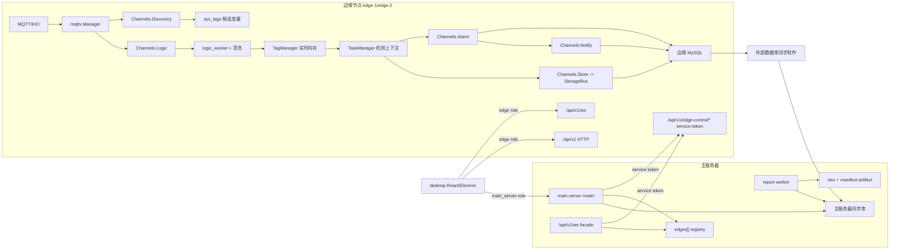

# 2026-06-07 当前软件地图与上下行数据流审阅

本文由 `review-ai` 按当前 worktree 真实扫描整理，不作为第二个活跃看板。开放任务和实施顺序仍以根目录 `AI_BOARD.md` 为准。

扫描时间：2026-06-07 17:14 Asia/Shanghai

本轮未运行新的测试命令；证据来自当前源码、schema、脚本和已有 smoke/report artifact 文件。

## 1. 扫描范围

已扫描的主要证据源：

- 协作状态：`MEMORY.md`、`AI_BOARD.md`、`.ai/instructions/ai-workflow.md`、`.ai/instructions/backend-go-edge.md`、`.ai/instructions/frontend-electron-react.md`、`.ai/instructions/testing-smoke.md`
- 后端总览文档：`backend/docs/backend-architecture.md`、`backend/docs/边缘端全链路数据流转与分发图.md`
- 边缘端后端：`backend/internal/runtime/kernel.go`、`backend/internal/database/*`、`backend/internal/pipeline/*`、`backend/internal/services/*`、`backend/internal/runtime/handlers/*`
- 主服务器后端：`main-server/backend/internal/server/router.go`、`main-server/backend/internal/server/edge_registry.go`、`main-server/backend/internal/server/ws_bridge.go`、`main-server/backend/internal/query/*`、`main-server/backend/internal/reports/*`
- 前端：`desktop/src/shared/config/env.ts`、`desktop/src/shared/api/http.ts`、`desktop/src/features/realtime/realtimeClient.ts`、`desktop/src/features/edge-status/api.ts`、`desktop/src/features/station-operation/StationOperationPage.tsx`、`desktop/src/features/reports/ReportsPage.tsx`、`desktop/src/features/task-flows/TaskFlowsPage.tsx`
- Schema：`backend/deploy/schema.sql`、`backend/deploy/migrations/20260603_add_gateway_edge_instance_id.sql`
- 现有测试证据：`desktop/output/playwright/eb041-main-server-contract-smoke-20260607020733.json`、`desktop/output/playwright/eb046-multi-report-smoke-20260606050916.json`、`desktop/output/playwright/pid-page-smoke-20260605064634.json`、`main-server/backend/data/reports/task-225-request-10-manifest.json`

## 2. 软件总地图

当前项目实际由四个运行面组成：

| 运行面 | 代码位置 | 当前职责 | 数据来源/去向 |
| --- | --- | --- | --- |
| 边缘端 Go 后端 | `backend/` | 现场采集、实时内存、检测任务、存储、报警、通知、edge-control 服务通道、边缘本地 API | 上接 MQTT/KIO，下写本地 MySQL，向前端/主服务器提供 HTTP/WS |
| 主服务器 Go 后端 | `main-server/backend/` | 统一登录、同步库只读查询、多 edge registry、HTTP/WS facade、edge-control 转发、报表 worker | 读同步库，service-token 连接对应边缘端，生成主服务器报表 artifact |
| 通用 Electron/React 前端 | `desktop/` | 当前主要交付 UI；通过 `VITE_APP_ROLE=edge/main_server` 切换边缘或主服务器 API base | 只走 HTTP/WS API，不直接访问 MySQL/MQTT/KIO |
| 过渡主服务器前端副本 | `main-server/desktop/` | 仍存在独立构建副本，但长期目标不是第二套业务页面 | 需要继续避免与 `desktop/` 长期分叉 |

外部系统：

- MQTT broker / KIO 上位机：现场实时数据源和物理下设通道。
- MySQL：边缘端本地业务库；主服务器侧读同步后的镜像库，并有 `main_report_*`、`main_notification_reads` 等主站自有表。
- 数据库同步软件：负责边缘库到主服务器镜像库的历史/任务/报表请求同步；当前应用层不实现历史同步。



## 3. 边缘端上行链路

上行指现场数据进入边缘端，并最终成为实时值、历史、报警、通知或任务流输入。

### 3.1 启动加载

当前代码证据：

- `backend/internal/runtime/kernel.go` 在 `Start()` 中加载 tags、active tasks、task rules、task flows、gateways，然后启动 discovery、notification dispatcher、task-flow、logic worker、cycle scanner、storage、alarm、MQTT。
- `backend/internal/database/gateways_repo.go` 的 `LoadGateways(edgeInstanceID)` 已按 `sys_gateways.edge_instance_id` 过滤本机网关，同时兼容空 edge 的 legacy rows。
- `backend/internal/database/variables_repo.go` 的 `LoadTags(edgeInstanceID)` 已 join `sys_projects`，按 `sys_projects.edge_instance_id` 过滤 enabled 且已分配 project 的变量。
- `backend/internal/pipeline/tag_manager.go` 的 `runtimeEligible()` 明确要求 `enabled && project_id != nil`，所以未分配候选变量不会进入运行态。

当前设计含义：

- 共享变量表本身不是问题，关键是 `sys_projects.edge_instance_id` 和 `sys_gateways.edge_instance_id` 要正确填充。
- 边缘端启动时不是“全库全量变量运行”，而是只把本机 edge 归属项目的 enabled 变量装入 `TagManager`。
- 空 `edge_instance_id` 仍是 legacy 兼容入口，多边缘生产数据不应依赖空 edge 归属。

### 3.2 MQTT/KIO 实时处理

当前代码证据：

- `backend/internal/pipeline/channels.go` 定义 `Logic/Discovery/Store/Alarm/Notify` 五条核心内存队列，并维护 dropped 计数。
- `backend/internal/pipeline/logic_worker.go` 从 `Channels.Logic` 取 MQTT 消息，按 `gateway_id + topic` 找 tag，解析 KIO/JSON 值，更新 tag runtime state。
- 同一 worker 在值变化时触发任务流、检测 task rules、默认/检测限值报警，并且只有当前项目有 active detection task 且允许存储时才把 `StoreTask` 投递到 `Channels.Store`。

数据流：

```text
MQTT/KIO payload
  -> mqttx.Manager
  -> Channels.Logic / Channels.Discovery
  -> logic_worker / discovery worker
  -> TagManager
  -> TaskFlowExecutor.Trigger
  -> TaskManager.EvaluateLimitAlarm / EvaluateDefaultLimitAlarm
  -> Channels.Store / Channels.Alarm / Channels.Notify
  -> MySQL
```

关键约束：

- MQTT callback 不直接写 MySQL。
- 发现链路只生成 disabled/unassigned 候选变量。
- 实时值以内存 `TagManager` 为权威。
- 历史写入只在检测任务 active 且变量存储快照允许时发生。

## 4. 边缘端下行/控制链路

下行指用户或主服务器发出控制动作，最终改变检测状态、虚拟变量或 KIO/PLC 现场变量。

当前边缘端服务通道：

- `backend/internal/runtime/handlers/edge_control_handler.go`
  - `GET /api/v1/edge-control/commands/:command_id`
  - `POST /api/v1/edge-control/detection/start`
  - `POST /api/v1/edge-control/detection/stop`
  - `POST /api/v1/edge-control/detection/abnormal-stop`
  - `POST /api/v1/edge-control/detection/pause`
  - `POST /api/v1/edge-control/detection/resume`
  - `POST /api/v1/edge-control/detection/mute-alarms`
  - `POST /api/v1/edge-control/detection/update-limits`
  - `POST /api/v1/edge-control/detection/refresh-features`
  - `POST /api/v1/edge-control/detection/report-requests`
  - `POST /api/v1/edge-control/variables/write`

边缘端控制语义：

- service-token scope 必须满足对应动作。
- 请求必须有 `command_id`。
- 必须能把主服务器操作者映射到 enabled edge user。
- 命令写入 `edge_control_commands`，包含 received/running/success/failed 生命周期。
- 成功和失败都会进入审计；状态接口不暴露原始 `request_json`。
- 变量写入统一走 `VariableWriteService`，物理 KIO 下设继续在后端受控服务内，不由前端直连 MQTT。

控制流：

```text
前端/主服务器 command
  -> 主服务器 JWT/权限校验
  -> project_id/task_id/var_id/project_code/var_name 解析目标 edge
  -> service-token edge-control envelope
  -> edge_control_commands 幂等和审计
  -> DetectionRunsService 或 VariableWriteService
  -> TaskManager / TagManager / KIOWriteService
  -> ack/error + command status + realtime readback
```

## 5. 主服务器多边缘路由

当前代码证据：

- `main-server/backend/internal/config/config.go` 已有 `edges[]`，`EnsureEdges()` 保证空配置回退到旧单 edge，但多 edge 配置是原生列表。
- `main-server/backend/internal/server/edge_registry.go` 维护 `edge_instance_id -> edgecontrol.Client`，并在 `/health`、`/api/v1/main-server/status` 暴露 `edge_nodes`。
- `resolveRealtimeEdgeInstanceID()` 先看 `project_id`，再校验显式 `edge_instance_id`，错配返回 `project_edge_instance_mismatch`。
- `resolveControlEdgeInstanceIDFromTarget()` 支持控制请求从 query/header、payload 顶层或 nested payload 中的 `project_id/task_id/var_id/project_code/var_name` 解析 edge。
- `main-server/backend/internal/server/ws_bridge.go` 对 realtime WS 连接 edge-control WS；对 `command.*` 则拦截后通过 edge-control HTTP 执行，而不是直接把危险命令透传给边缘 WS。

主服务器职责边界：

| 业务 | 当前主服务器行为 | 权威来源 |
| --- | --- | --- |
| 登录/权限 | 主服务器 JWT 和角色权限 | 主服务器 auth 表 |
| 实时变量 | 按 edge 路由到边缘 `TagManager` | 边缘内存 |
| WS realtime | 主站 WS facade，边缘消息注入 `edge_instance_id` | 边缘 WS |
| 控制命令 | 主站鉴权和 edge resolver，edge-control 执行 | 边缘服务 |
| 网关运行态 | service-token 转发到边缘 `mqtt.Manager.Status()` | 边缘内存 |
| 历史/任务/报表请求 | 读同步库 | 主服务器同步库 |
| 报表生成 | 主服务器 worker 消费同步库 | 主服务器报表表和 artifact |

已有 smoke 证据：

- `desktop/output/playwright/eb041-main-server-contract-smoke-20260607020733.json`
  - `edge_nodes=edge-1/edge-2`
  - `device_id` 在 edge/main 的 variables/realtime 均返回 `400 unsupported_query_param`
  - HTTP realtime 按 project 自动路由到两边缘
  - WS realtime 对 edge-2 project 返回 `edge_instance_id=edge-2`
  - command-only WS 不带 URL edge，仅靠 payload `project_id/var_id` 路由到 edge-2 并 ack
  - edge-2 停止时 edge-2 realtime/runtime/control 返回 502，edge-1 仍可用
  - main_server 浏览器业务 API/WS 无直连 18080/18081

结论：一主多边缘基础路由已不是“大改缺失”，但仍依赖 project/gateway edge 归属数据质量和对应 smoke 持续覆盖。

## 6. 检测任务链路

当前代码证据：

- `backend/internal/database/detection_repo.go` 的 `StartDetectionTaskWithOptions()` 在事务内锁项目，防止同项目并行 running 任务。
- 启动任务会冻结：
  - `detection_run_standard_items`
  - `detection_run_storage_routes`
  - `detection_run_report_requests`
  - `custom_config_json`
- `backend/internal/services/detection_runs_service.go` 启动后 `TaskManager.SetActive()`，停止/暂停时从 `TaskManager` 清除，停止后刷新 summary/features 并发通知。
- `backend/internal/pipeline/task_flow_executor.go` 具备 `builtin.start_detection_run`、`builtin.write_control_variables`、`qualified_hold` guard 等业务模块。

检测任务数据流：

```text
页面或任务流提交检测参数
  -> DetectionRunsService.Start
  -> sys_detection_tasks
  -> detection_run_standard_items
  -> detection_run_storage_routes
  -> detection_run_report_requests
  -> TaskManager active context
  -> 实时值触发 Store/Alarm/TaskFlow
  -> Stop/Pause/Resume
  -> detection_run_summaries / detection_run_features / detection_run_events
  -> 通知
```

当前注意点：

- 正式低频复杂业务参数建议走 watched `STRING` 虚拟变量 + 任务流模块，HTTP start 仍作为兼容/开发 smoke 入口。
- `report_request.reports[]` 已是原生入口，一次检测可冻结多份报表请求。
- `custom_items` 是本次任务的检测项快照，不应混入工艺参数；工艺参数进入 `process_params`，PLC 下设进入 `plc_writes`。

## 7. 报表链路

### 7.1 当前设计

边缘端：

- 启动检测时冻结 `report_request`。
- 推荐格式是 `report_request.reports[]`，每个 item 选择模板、变量集合和 `params`。
- 落库表为 `detection_run_report_requests`，语义是一行一份报表请求，不是一行一个变量。

主服务器：

- `main-server/backend/internal/query/report_readiness.go` 的 `ReportReadiness()` 检查任务停止、报表请求、summary、history、features、alarm rows。
- `main-server/backend/internal/reports/service.go` 的 `EnqueueTask()` 为每条 report request 创建 job，job key 包含 `edge_instance_id/task_id/request_id`。
- `main-server/backend/internal/reports/package.go` 的 `ReportPackage` 包含任务身份、report、变量、全检测指标、连续两小时合格窗口指标、上下限快照、params 和 cell mapping version。
- `applyCellMapping()` 支持 `task.*`、`request.*`、`summary.*`、`param.*`、`variable.*`、`metric.*`、`limit.*` 等 source 写入指定 sheet/cell；required source 缺失会让 job 失败。

报表数据流：

```text
report_request.reports[]
  -> detection_run_report_requests
  -> 外部 DB sync
  -> main-server ReportReadiness
  -> main_report_jobs / events
  -> ReportPackage
  -> Excel workbook + Manifest_JSON / Report_Package
  -> artifact download / report notifications
```

### 7.2 已有证据

- `desktop/output/playwright/eb046-multi-report-smoke-20260606050916.json`
  - edge 页面和 main_server 页面均从工位开始检测弹窗提交至少两份 report request。
  - 边缘端和主服务器都能看到 report request snapshots。
  - 主服务器 report jobs 至少两条成功，并下载 artifacts。
  - main_server 浏览器业务 API 只连 `19080`。
- `main-server/backend/data/reports/task-225-request-10-manifest.json`
  - readiness checks 全部 ok。
  - `counts.report_requests=2`、`history_rows=8`、`feature_rows=2`。
  - report package 中变量 `avg_value=67`、上下限来自 `detection_run_standard_items`，`qualified_two_hours.status=insufficient` 并说明窗口不足两小时。

### 7.3 尚未关闭的关键点

报表链路不是从零缺失，但当前仍不能宣布“客户报表最终通过”：

- 需要用真实或受控 smoke 数据复验 Excel `Report_Package` 与客户可见 sheet/cell mapping 一致。
- 需要至少两份 report request，证明多报表之间变量集合、指标、params、上下限、窗口状态相互独立。
- 需要核对全检测平均值、连续两小时合格窗口、任务编号、检测时间范围、上下限来源、单位、判定参数和缺数据语义。
- 客户原始 workbook 不在仓库内，因此客户真实模板字段复核只能标记为 field blocked，不能用默认模板 smoke 冒充客户 workbook 验收。

## 8. 前端数据流

### 8.1 运行角色

当前代码证据：

- `desktop/src/shared/config/env.ts`
  - `VITE_APP_ROLE=edge` 默认指向 `18080`。
  - `VITE_APP_ROLE=main_server` 指向 `VITE_MAIN_API_BASE_URL`，默认 `19080`。
- `desktop/src/shared/api/http.ts`
  - 所有 HTTP 通过 `apiClient` 注入 JWT。
- `desktop/src/features/realtime/realtimeClient.ts`
  - 所有 WS 使用 `env.apiBaseUrl + /api/v1/ws`。
  - command-only WS 不带 topic，发 `command.*` 后等待 `command.ack` 或 `error`。

### 8.2 页面地图

当前路由证据来自 `desktop/src/app/router.tsx` 和 `ShellLayout.tsx`：

| 路由 | 页面 | 当前业务 |
| --- | --- | --- |
| `/`、`/station` | `StationOperationPage` | 工位实时、检测控制、PID、运行快照、存储快照、报警、station view |
| `/model-cockpit` | `ModelCockpitPage` | 3D/驾驶舱实时展示 |
| `/history` | `HistoryQueryPage` | 检测历史、存储路由快照、趋势/表格 |
| `/reports` | `ReportsPage` | 主服务器 report jobs/readiness/events/requests/artifact |
| `/notifications` | `NotificationCenterPage` | HTTP 通知列表 + WS 即时刷新 |
| `/alarms` | `AlarmCenterPage` | 限值报警查询 |
| `/variables` | `VariableConfigPage` | 变量配置、分配、可写属性 |
| `/detection-config` | `DetectionConfigPage` | 检测标准和检测项配置 |
| `/tasks` | `TaskFlowsPage` | 任务流、任务请求、内置模块 |
| `/settings` | `SettingsPage` | 网关、项目、变量、存储路由、用户等管理 |
| `/debug` | `EdgeStatusPage` | 健康、runtime channels/workers、诊断 |

### 8.3 工位/PID 链路

当前代码证据：

- 工位页读取 `project_id` 和可选 `edge_instance_id`。
- `getStationViewEffective(project_id, edge_instance_id)` 返回 station view 和 WS subscription。
- 运行实时订阅走 `subscribeRealtimeWebSocket({ topics:['realtime.variables'], project_id, edge_instance_id, var_ids })`。
- PID 弹窗按 `project_id + var_group + writable=true + enabled=true` 查询变量。
- PID 值展示合并 HTTP snapshot 和 WS snapshot。
- PID 下设用 `sendRealtimeWebSocketCommand({ type:'command.write_variable', payload:{ var_id, project_id, edge_instance_id, wait_ack:true } })`，再显示 pending/ack/error/result。

已有证据：

- `desktop/output/playwright/pid-page-smoke-20260605064634.json` 证明 main_server 模式 API host 为 `19080`，工位页、PID 变量列表和 WS/HTTP 请求不直连 edge。

当前判断：

- PID 页面已符合“多个 PID 值、WS 实时显示、实时下设 PID”的最小闭环方向。
- 后续不是拖拽设计器问题，而是现场变量命名、动态小数点、更多组合和压力/慢客户端的问题。

## 9. Schema 地图

当前 `backend/deploy/schema.sql` 已覆盖以下核心表族：

| 表族 | 核心表 | 职责 |
| --- | --- | --- |
| 边缘归属 | `sys_gateways.edge_instance_id`、`sys_projects.edge_instance_id` | 单主多边缘分流基础 |
| 变量 | `sys_tags` | 来源、项目归属、运行态资格、可写约束、默认限值 |
| 存储 | `sys_storage_routes`、`detection_run_storage_routes`、`rt_history_data`、项目宽表 | 存储配置和检测期冻结写入 |
| 检测标准 | `sys_detection_standards`、`sys_detection_standard_items`、favorites/recents | 可编辑标准和显示字段 |
| 检测任务 | `sys_detection_tasks`、`detection_run_standard_items`、`detection_run_events`、`detection_run_summaries`、`detection_run_features` | 检测运行事实和结果 |
| 报表 | `sys_report_templates`、`detection_run_report_requests`、`detection_run_reports`、主服务器 `main_report_*` auto migrate | 报表请求快照和主站 job/artifact |
| 任务流 | `sys_task_flows`、`sys_task_flow_vars`、`task_flow_runs`、`task_flow_sql_logs` | 低频业务编排和记录 |
| 控制审计 | `edge_control_commands`、`sys_audit_logs` | edge-control 命令生命周期和审计 |
| 通知/报警 | `detection_limit_alarms`、`sys_notifications`、`sys_notification_recipients` | 报警生命周期、通知、已读状态 |
| 登录/SSO | `sys_users`、`sys_service_clients`、`sys_sso_tickets` | 本地用户、service-token、SSO |

## 10. 当前项目进度判断

已经开始收敛的部分：

1. 单主多边缘地基：已落到 schema、边缘启动过滤、主服务器 `edges[]`、HTTP/WS realtime、control resolver 和 smoke 证据。
2. 前端不区分边缘：通用 `desktop` 通过 runtime role 切主服务器，浏览器业务 API/WS 不直连边缘的 smoke 已有多轮证据。
3. 变量表共享但各自区分：当前模型依赖 `sys_projects.edge_instance_id` 与 `sys_gateways.edge_instance_id`，并在变量分配时拒绝 project/gateway edge mismatch。
4. 控制命令自动路由：主服务器 HTTP/WS command 都按业务 payload 定位 edge，并保留边缘端 command lifecycle/audit。
5. PID 最小闭环：多 PID 变量展示、WS snapshot、统一提交、ack/error/result 已有代码和 smoke 证据。
6. 报表基础链路：多 `report_request`、readiness、jobs、artifact、manifest、ReportPackage、全检测均值、两小时窗口和 cell mapping 代码都存在，且已有默认/受控 smoke 证据。
7. 通知/报警：边缘端通知持久化和 WS fan-out、主服务器通知镜像和已读覆盖、通知页面 smoke 已有证据。

仍待解决或复验的部分：

1. 报表数据口径复验是当前第一优先级。需要重新用受控 smoke 或真实任务验证 Excel 内客户可见 cell 与 `Report_Package`/manifest 一致，覆盖至少两份 report request。
2. 客户原始 workbook 缺失，真实客户模板验收不能关闭，只能登记 `field blocked`。
3. 2026-06-07 插单改过的开始检测弹窗和检测配置页，还需要纳入现有 smoke，防止布局变更破坏 `report_request.reports[]` payload 或 main_server `19080` 边界。
4. `main-server/desktop` 仍是过渡副本，不能长期作为第二套业务页面扩张；后续应继续以 `desktop/` 为主收敛。
5. 空 `edge_instance_id` legacy 兼容仍存在。生产多边缘数据必须填 edge 归属，否则会重新进入歧义/fallback 风险。
6. 压测、慢客户端、大订阅、跨边缘聚合和拖拽设计器当前按用户要求不排入本轮施工。

## 11. 下一步实施顺序

1. `test-ai/backend-ai`：优先做报表数据口径复验。
   - 创建或复用受控检测任务。
   - 至少两份 `report_request`。
   - 验证 readiness、job、events、artifact、manifest、Excel `Report_Package`。
   - 读取实际 xlsx，核对客户可见 sheet/cell mapping、全检测平均值、连续两小时合格窗口、任务编号、检测时间范围、上下限来源、单位、判定参数、缺数据语义。
   - 不允许用默认空模板、前端本地公式或 mock 当通过。

2. `frontend-ai/test-ai`：把 2026-06-07 新布局纳入 smoke。
   - 开始检测弹窗提交仍是原生 `report_request.reports[]`。
   - 检测配置页仍能读取项目、标准、变量和检测项。
   - main_server 模式业务 API/WS 仍只走 `19080`。
   - 不新增操作员必须手选 edge 的裸逻辑。

3. `review-ai`：根据报表复验证据做关闭审计。
   - 如果只有客户原始 workbook 不可得，则 EB-069 标记 `field blocked`。
   - 如果发现计算、映射或 readiness 口径错误，再拆给 `backend-ai/test-ai` 精准修复。

4. 暂停项保持暂停。
   - 压测当前不能做。
   - 拖拽设计器不进入当前主线。
   - 跨边缘聚合不进入当前主线。

## 12. 总结

当前项目不是“需要整体大改”的状态。核心架构已经从早期单 edge 假设收敛到一主多边缘：边缘端按 edge 加载网关/变量，主服务器按 project/edge 自动路由 HTTP/WS 和 command，前端在 main_server 模式不需要区分边缘。下一步最紧要的不是继续扩架构，而是把报表数据口径和新前端布局做实证验收，避免报表和页面交互成为后续返工点。
