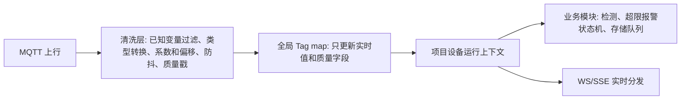

# 变量默认上下限与业务报警装配设计

## 目标

本设计解决“变量默认上下限属性”和“检测业务报警配置”如何共存、装配和更新，并已落地检测业务上下限报警的 `enter/recover` 首段状态机。脚本规则引擎、KIO/WS 写入闭环、默认变量报警独立表和 `level_change` 仍不在本阶段实现。

核心原则：

- `sys_tags` 保存变量自身的默认属性，包括默认上下限、默认回差和默认报警是否启用。
- 变量默认报警不包含静音功能；静音属于检测业务运行态策略，用来抑制当前检测任务内已确认的业务报警。
- 检测业务以 `sys_detection_standards` / `sys_detection_standard_items` 为主，检测开始后冻结到 `detection_run_standard_items`。
- 实时数据清洗后的全局 Tag map 不保存检测上下限，避免每次采集都混入业务配置读取。
- 项目设备级运行上下文从 `detection_run_standard_items` 装配业务所需字段，后续报警、存储、WS 分发都读内存上下文，不在数据改变时查数据库。

## 数据分层

### 变量默认属性

`sys_tags` 增加变量默认检测属性：

- `default_alarm_enabled`：变量默认报警是否启用。默认 `false`，只表示变量级默认报警开关，不承担检测任务静音。
- `default_limit_ll`：默认下下限。
- `default_limit_l`：默认下限。
- `default_limit_h`：默认上限。
- `default_limit_hh`：默认上上限。
- `default_limit_deadband`：默认回差。
- `default_violation_hold_ms`：变量级默认进入报警保持时间。
- `default_recover_hold_ms`：变量级默认恢复保持时间。

这些字段属于变量资产配置，支持前端在变量属性页实时编辑。它们不是当前检测任务的唯一依据，也不会直接写进全局 Tag map。

### 检测标准和检测运行策略

`sys_detection_standard_items` 保存业务检测配置：

- `check_enabled`：是否参与检测判断。
- `alarm_enabled`：是否生成超限报警事件。
- `store_enabled`：是否允许检测中存储。
- `limit_ll` / `limit_l` / `limit_h` / `limit_hh` / `limit_deadband`：本检测标准使用的上下限和回差。
- `violation_hold_ms` / `recover_hold_ms` / `quality_policy`：保持时间和质量策略。
- `check_cycle_ms`：检测业务判断周期，和存储周期分开；无论是否为 `0`，都不参与存储周期计算。历史入库周期只读取 `sys_storage_routes.cycle_ms`，默认 route 建议值为 `20000ms`。
- `check_on_start`：检测启动时是否立刻用当前设备变量 map 的值做一次判断。

检测标准是业务配置，优先级高于变量默认属性。

检测静音属于运行中的检测业务策略，不写入变量默认报警配置。其语义是：用户在某次检测中点击静音时，系统记录“此刻已经处于报警的业务报警项”，这些项持续报警期间不再提醒；如果新增报警出现，或已恢复的项再次进入报警，仍应提醒并记录。这一策略后续应落在检测任务运行态和检测报警表/事件上，而不是落在 `sys_tags.default_*` 字段上。

### 运行任务快照

检测开始时，后端把检测标准项、变量存储映射和变量默认属性冻结到 `detection_run_standard_items`：

- 标准实际使用值：`alarm_enabled`、`limit_*`、`limit_deadband`、保持时间、质量策略。
- 变量默认快照：`variable_default_alarm_enabled`、`variable_default_limit_*`、`variable_default_limit_deadband`。
- 变量默认保持时间快照：`variable_default_violation_hold_ms`、`variable_default_recover_hold_ms`。
- 存储映射快照：`storage_target`、`storage_table`、`storage_value_column`、`query_alias` 等。

这样做的目的：

- 已开始的任务有可审计的规则快照。
- 后续变量默认属性变化不会悄悄改变历史任务。
- 如果用户明确要求运行中同步，后端只更新 running 任务的变量默认快照，不覆盖业务检测标准项。

## 装配时机

检测任务启动时：

1. 锁定项目设备行，保证同一项目设备只有一个 running 任务。
2. 读取检测标准项。
3. 读取涉及变量的 `sys_tags` 默认属性和存储映射。
4. 写入 `sys_detection_tasks` 和 `detection_run_standard_items`。
5. TaskManager 从运行快照加载内存上下文。
6. 对 `startup_snapshot_enable=true` 的变量，检测启动时把设备变量 map 中已有当前值投递到存储队列。
7. 对 `check_on_start=true` 的数值检测项，检测启动时用当前值做一次即时判定；满足保持时间后通过 `Alarm` 队列写入 `detection_limit_alarms`。

运行中数据变化或周期扫描时：

1. 清洗层只更新 `Tag` 实时值、质量戳和稳定值状态。
2. `TaskManager` 从设备运行上下文读取当前任务和 `detection_run_standard_items` 快照。
3. 按 `check_enabled/alarm_enabled/check_cycle_ms/check_method/quality_policy` 决定是否判断。
4. 按业务 `limit_hh/limit_h/limit_l/limit_ll`、`limit_deadband`、`violation_hold_ms`、`recover_hold_ms` 维护每任务每变量的报警状态。
5. 进入和恢复事件写入 `Alarm` 队列，由 storage worker 批量入库；MQTT 热路径不直接写 MySQL。

检测事件和结果摘要：

- `detection_run_events` 记录任务开始、正常停止、异常停止等低频生命周期事件。
- `detection_run_summaries` 记录每次任务的聚合结果，包括历史行数、报警总数、未恢复数、已恢复数、上限/下限报警计数和最终 `ok/ng/running` 状态。
- 高频逐变量超限明细不复制到事件表，仍以 `detection_limit_alarms` 作为明细来源，避免报警高峰时产生双倍写入压力。

## 运行中更新

变量属性更新接口支持 `apply_to_running`：

- `false` 或未传：只更新 `sys_tags`，影响未来任务。
- `true`：更新 `sys_tags` 后，同步当前 running 任务中同一变量的 `variable_default_*` 快照。

注意：

- `apply_to_running=true` 不修改 `detection_run_standard_items.alarm_enabled` 和 `limit_*`，避免变量默认配置覆盖业务检测标准。
- 检测标准运行中即时生效仍是暂缓项，后续应通过独立的“运行任务标准调整”接口处理。

## 已验证性能

2026-05-30 使用 `PERF-520-20260530-003212` 做 520 变量 10 分钟压测：

- 发布 312000 次变量更新，模式为上限超限 -> 恢复 -> 下限超限 -> 恢复。
- MQTT 订阅延迟 avg 2.8ms，p95 3.7ms，max 12.4ms。
- `detection_limit_alarms` 生成 31200 条，全部 recovered；`above_h=15600`，`below_l=15600`。
- `rt_history_data` 写入 322920 行。
- health 采样 120 次，队列最大值：`alarm=520`、`store=120`、`logic=0`；结束后所有队列为 0。

## 暂缓项占位

- 超限报警 `level_change` 状态机。
- 变量默认报警独立表已废弃，当前统一写入 `detection_limit_alarms` 并用 `scope=default|detection` 区分。
- 检测业务静音策略。
- 检测配置运行中即时生效。
- KIO/WS 变量下设完整闭环。
- 多变量组合触发任务和 `var_id -> rule_ids` 倒排索引。
- 变量默认属性作为标准缺省值的自动填充策略。

## 测试要求

- 创建变量时可写入默认上下限和默认报警开关。
- 修改变量默认上下限时校验 `LL <= L <= H <= HH`。
- 修改变量默认回差时拒绝负数。
- 检测开始时运行快照包含变量默认属性和业务检测项。
- `apply_to_running=true` 只同步 running 任务的 `variable_default_*` 快照。
- `apply_to_running=false` 不影响已运行任务快照。
