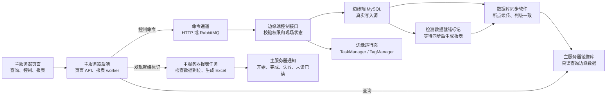

# 边缘端与主服务器协同计划

最后更新：2026-06-01

维护责任：`backend-ai`

本文档记录未来主服务器和边缘端之间的协同边界。当前主服务器代码不在本项目目录内，本文件只作为边缘端后端的未来对接计划，不代表已经实现。

## 1. 英文名词中文解释

| 英文名词 | 中文解释 |
| --- | --- |
| `Edge` / 边缘端 | 现场边缘服务器，负责采集、清洗、运行态内存、现场控制、检测任务执行、本地历史入库。 |
| `Main Server` / 主服务器 | 中心服务器，负责跨边缘端查看数据、报表生成、归档、主服务器用户通知和管理页面。 |
| `Database Sync` / 数据库同步软件 | 独立同步软件，把边缘端数据库表同步到主服务器镜像库，支持断点续传。只要表结构列保持一致，就能同步相同数据。 |
| `Mirror DB` / 镜像库 | 主服务器侧同步出来的边缘端数据库副本，主服务器用于查询，不作为现场控制写入源。 |
| `Command Channel` / 命令通道 | 主服务器向边缘端发送控制命令的通道，候选是 HTTP 或 RabbitMQ。 |
| `Report Job` / 报表任务 | 主服务器基于同步到位的检测数据生成 Excel 报表、归档文件和通知用户的异步任务。 |
| `Data Ready` / 数据就绪 | 边缘端确认某次检测的历史、报警、摘要、特征值等已经在边缘端本地写完，可以等待同步到主服务器后生成报表。 |

## 2. 总原则

1. 主服务器可以查询同步过去的边缘端数据。
2. 主服务器不能直接修改同步库中的边缘端业务表来控制现场。
3. 任何会影响现场机器、运行态内存、检测配置、检测任务状态的写操作，必须回到边缘端执行。
4. 数据库同步软件只解决“读数据一致”和“断点续传”，不承担控制命令、运行态刷新、权限校验和异步报表任务。
5. 主服务器报表和通知属于主服务器自己的业务，不应该回写边缘端运行表。

## 3. 未来总链路



## 4. 主服务器查询边界

主服务器可以从镜像库查询：

- 项目、变量、检测任务。
- 检测标准快照。
- 存储路由快照。
- 历史数据。
- 检测报警记录。
- 检测摘要。
- 检测特征值。
- 边缘端生成的事件流水。
- 边缘端报表请求或数据就绪标记。

主服务器不应该直接改这些同步表：

- `sys_detection_tasks`
- `sys_detection_standards`
- `sys_detection_standard_items`
- `detection_run_standard_items`
- `sys_storage_routes`
- `sys_tags`
- `sys_projects`

原因：直接改同步库不会刷新边缘端运行态，也不会控制现场设备，甚至可能和边缘端真实写入产生冲突。

## 5. 主服务器控制边缘端链路

主服务器页面如果要开始检测、停止检测、修改检测配置或写变量，应该走命令通道。

```text
主服务器页面
  -> 主服务器后端命令接口
  -> 命令通道（HTTP 或 RabbitMQ）
  -> 边缘端后端
  -> 边缘端权限校验、状态校验、幂等校验
  -> 边缘端写本地 MySQL
  -> 边缘端更新运行态 TaskManager / TagManager
  -> 边缘端返回命令结果
  -> 数据库同步软件把结果同步回主服务器
```

命令通道后续需要定义：

- 命令唯一 ID。
- 幂等规则。
- 超时规则。
- 重试规则。
- 命令执行结果。
- 失败错误码。
- 主服务器用户和边缘端审计映射。

## 6. 报表任务未来链路

报表生成建议归主服务器处理，因为报表通常服务主服务器用户、归档和下载。

边缘端负责：

```text
检测结束
  -> 确认存储队列、报警队列、摘要、特征值完成
  -> 写数据就绪标记或报表请求
  -> 等待数据库同步软件同步
```

主服务器负责：

```text
发现边缘端报表请求或数据就绪标记
  -> 检查镜像库数据是否到位
  -> 创建主服务器报表任务
  -> 通知用户：报表开始生成
  -> 生成 Excel 报表
  -> 归档报表文件
  -> 通知用户：报表完成或失败
```

## 7. 数据是否同步到位的判断

主服务器报表 worker 不能只看 `sys_detection_tasks.status=stopped`，还要确认关键数据已经同步到位。

建议检查：

1. `sys_detection_tasks` 已同步，且任务状态为 `stopped`。
2. `detection_run_summaries` 已同步。
3. `detection_run_features` 已同步，或该报表模板明确不需要特征值。
4. 历史数据行数达到边缘端写出的期望值。
5. 报警记录数量达到边缘端摘要中的报警数量。
6. 边缘端写出的 `data_ready_at` 已同步。

## 8. 边缘端报表请求快照和未来数据就绪表

当前边缘端已经实现报表请求快照表：

```text
detection_run_report_requests
```

中文含义：检测运行报表请求快照。

这张表由边缘端在检测启动时写入，主服务器只读同步后的镜像数据。它不是 Excel 文件表，也不是主服务器报表任务表；主服务器仍应创建自己的报表任务和文件记录。

当前关键字段：

| 字段 | 中文含义 |
| --- | --- |
| `id` | 主键。 |
| `task_id` | 检测任务 ID。 |
| `test_no` | 检测编号。 |
| `project_id` | 项目 ID。 |
| `project_code` | 项目编码。 |
| `template_id` | 边缘端登记的模板 ID 快照，可为空。 |
| `template_code` | 模板编码快照。 |
| `template_version` | 模板版本快照。 |
| `var_id` / `var_name` / `display_name*` | 第一变量摘要字段，兼容旧前端和列表展示。 |
| `variables_json` | 本报表请求包含的完整变量组。 |
| `params_json` | 本报表请求的模板公式参数。 |
| `status` | 边缘端请求状态，当前默认 `pending`。 |
| `ext_1` / `ext_2` / `ext_3` | 旧兼容预留字段，新参数应使用 `params_json`。 |

未来如果主服务器需要更强的数据到位判断，可以再新增边缘端拥有的数据就绪表，例如：

```text
detection_report_ready
```

中文含义：检测报表数据就绪标记。

建议字段：

| 字段 | 中文含义 |
| --- | --- |
| `id` | 主键。 |
| `request_id` | 报表请求唯一编号。 |
| `edge_instance_id` | 边缘端实例编号。 |
| `task_id` | 检测任务 ID。 |
| `test_no` | 检测编号。 |
| `project_id` | 项目 ID。 |
| `project_code` | 项目编码。 |
| `report_template_id` | 报表模板 ID。 |
| `report_template_code` | 报表模板编码。 |
| `report_template_version` | 报表模板版本。 |
| `expected_history_rows` | 期望历史数据行数。 |
| `expected_alarm_total` | 期望报警记录数量。 |
| `expected_feature_count` | 期望特征值数量。 |
| `data_ready_at` | 边缘端确认数据就绪时间。 |
| `created_at` | 创建时间。 |

这张表由边缘端写，主服务器只读镜像数据并创建自己的主服务器报表任务。

## 9. 主服务器自己的表

主服务器应拥有自己的业务表，不要回写边缘端同步表。

建议主服务器拥有：

- 主服务器报表任务表。
- 主服务器报表文件表。
- 主服务器通知表。
- 主服务器通知接收对象表。
- 主服务器用户未读/已读表。

主服务器通知包括：

- 报表开始生成。
- 报表生成完成。
- 报表生成失败。
- 归档完成。
- 主服务器侧业务处理异常。

## 10. 页面复用原则

边缘端页面和主服务器页面可以长得相似，但数据方向不同。

| 页面动作 | 边缘端页面 | 主服务器页面 |
| --- | --- | --- |
| 查询实时数据 | 连边缘端 HTTP/WS | 查主服务器镜像库，或通过主服务器聚合实时通道。 |
| 查询历史数据 | 查边缘端本地库 | 查主服务器镜像库。 |
| 开始检测 | 直接调用边缘端后端 | 主服务器发命令到边缘端执行。 |
| 修改检测配置 | 调用边缘端后端并刷新运行态 | 主服务器发配置命令到边缘端执行。 |
| 生成报表 | 当前边缘端只登记模板和结果 | 主服务器基于同步数据执行报表任务。 |
| 用户通知 | 边缘端本地通知 | 主服务器通知中心。 |

## 11. 暂缓实施项

这部分当前只作为未来计划，暂缓直接实现：

1. 边缘端数据就绪标记表。
2. 主服务器报表任务 worker。
3. 主服务器通知中心。
4. 边缘端到主服务器命令通道。
5. 主服务器检查同步数据到位的策略。
6. 主服务器页面和边缘端页面的 API 适配层。
