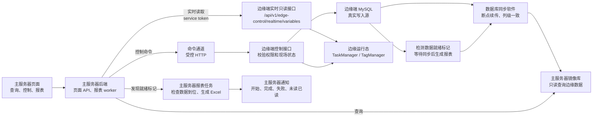

# 边缘端与主服务器协同计划

最后更新：2026-06-03

维护责任：`backend-ai`

本文档记录主服务器和边缘端之间的协同边界。当前项目已包含 `main-server/backend` 骨架，并已完成首批同步库只读接口；未明确标注“已实现”的内容仍是后续计划。

数据库同步模式、表所有权和分阶段改造细节见 [边缘端与主服务器数据库同步及改造计划](./边缘端与主服务器数据库同步及改造计划.md)。

## 1. 英文名词中文解释

| 英文名词 | 中文解释 |
| --- | --- |
| `Edge` / 边缘端 | 现场边缘服务器，负责采集、清洗、运行态内存、现场控制、检测任务执行、本地历史入库。 |
| `Main Server` / 主服务器 | 中心服务器，负责跨边缘端查看数据、报表生成、归档、主服务器用户通知和管理页面。 |
| `Database Sync` / 数据库同步软件 | 独立同步软件，把边缘端数据库表同步到主服务器镜像库，支持断点续传。只要表结构列保持一致，就能同步相同数据。 |
| `Mirror DB` / 镜像库 | 主服务器侧同步出来的边缘端数据库副本，主服务器用于查询，不作为现场控制写入源。 |
| `Command Channel` / 命令通道 | 主服务器向边缘端发送控制命令的通道，首版确定使用受控 HTTP。 |
| `Report Job` / 报表任务 | 主服务器基于同步到位的检测数据生成 Excel 报表、归档文件和通知用户的异步任务。 |
| `Data Ready` / 数据就绪 | 边缘端确认某次检测的历史、报警、摘要、特征值等已经在边缘端本地写完，可以等待同步到主服务器后生成报表。 |

## 2. 总原则

1. 主服务器可以查询同步过去的边缘端数据。
2. 主服务器不能直接修改同步库中的边缘端业务表来控制现场。
3. 任何会影响现场机器、运行态内存、检测配置、检测任务状态的写操作，必须回到边缘端执行。
4. 数据库同步软件只解决“读数据一致”和“断点续传”，不承担控制命令、运行态刷新、权限校验和异步报表任务。
5. 主服务器报表和通知属于主服务器自己的业务，不应该回写边缘端运行表。

## 2.1 当前已实现的主服务器节点

当前 `main-server/backend` 已实现：

- `GET /health`：返回主服务器健康状态、数据库状态和 `edge_instance_id`。
- `GET /api/v1/main-server/status`：返回主服务器角色、同步库名称、查询代理状态和 `edge_nodes[]`。当前 `query_proxy_enabled=false`，旧迁移期读代理运行时已关闭；`edge_nodes[]` 中文含义是“主服务器已知边缘节点列表”，包含 `edge_instance_id`、边缘地址、同步库名、service token 引用和 enabled 状态。
- `GET /api/v1/main-server/sync-diagnostics`：主服务器受保护同步库诊断接口，读取当前镜像库关键同步表，返回每张表的 `ok/missing/error`、行数、最新时间列和缺失表列表；缺同步表时返回 `200 overall_status=degraded`，方便页面和测试展示具体缺口，不用空数组或 mock 冒充同步正常。
- `GET /api/v1/main-server/report-readiness?task_id=...`：主服务器受保护报表数据就绪诊断接口，读取同步库真实检测任务、报表请求快照、摘要、特征值、历史数据、存储路由和检测报警，返回 `overall_status=ready|waiting|not_requested`、检查项、每份报表请求缺失的历史/特征变量和计数。它只判断同步数据是否足够生成报表，不创建主服务器报表任务、不生成 Excel、不写同步库。
- `GET /api/v1/system/database-config`：主服务器受保护本地数据库配置只读接口，返回主服务器自身镜像库连接配置的 `host/port/user/name/password_set/read_only/source`，不代理到边缘端，不返回明文密码；`PATCH /api/v1/system/database-config` 和 `POST /api/v1/system/database-config/test` 当前返回 `501 main_server_database_config_read_only`，主服务器数据库配置仍通过配置文件和进程重启管理。
- `GET /api/v1/gateway-configs`、`GET /api/v1/gateway-configs/:gateway_id`：主服务器受保护同名网关配置只读接口，读取同步库真实 `sys_gateways`，返回边缘端兼容 DTO 且不暴露 `password/kio_write_password`。网关配置写入、发现、发布订阅和 KIO 下设仍必须回到边缘端或后续受控命令。
- `GET /api/v1/projects/:id/members`：主服务器受保护同名项目成员只读接口，读取同步库真实 `sys_project_members` 并 JOIN 同步 `sys_users`，返回项目成员用户名、用户角色、启用状态、成员角色和通知开关；按 `edge_instance_id` 上下文排除显式归属其他边缘项目。主服务器当前不直接写项目成员表，保存成员配置仍需回到边缘端或后续受控命令。
- `GET /api/v1/gateways`：主服务器显式返回 `501 main_server_runtime_diagnostic_unsupported`，不让 MQTT 网关在线状态落入迁移期 query proxy。网关在线状态属于边缘端 MQTT 运行态，后续若主服务器页面需要显示，应另行设计明确的网关运行态 service-token 只读接口。
- `GET /api/v1/runtime/channels`、`GET /api/v1/runtime/channels/detail`、`GET /api/v1/runtime/notifications`、`GET /api/v1/runtime/workers`、`GET /api/v1/task-flows/runtime`：主服务器现在通过 service token 转发到边缘端 `/api/v1/edge-control/runtime/*` 和 `/api/v1/edge-control/task-flows/runtime`，读取边缘端核心队列、通知 hub、worker 生命周期和任务流执行队列诊断；缺 token 返回 `503 edge_runtime_token_missing`，禁用返回 `503 edge_runtime_disabled`，边缘不可达返回 `502 edge_runtime_unavailable`。
- `GET /api/v1/task-modules`、`GET /api/v1/task-flow-templates`：主服务器现在通过 service token 转发到边缘端 `/api/v1/edge-control/task-modules` 和 `/api/v1/edge-control/task-flow-templates`，读取边缘端任务执行元数据；缺 token 返回 `503 edge_metadata_token_missing`，禁用返回 `503 edge_metadata_disabled`，边缘不可达返回 `502 edge_metadata_unavailable`。
- `GET /api/v1/ws`：主服务器显式返回 `501 main_server_realtime_ws_unsupported`。边缘端 WS 同时承载实时内存快照和写变量/开始检测等控制命令，鉴权模型是边缘端用户；主服务器当前只能用 `/api/v1/realtime/variables` 做 service-token HTTP 只读实时镜像，不能裸代理 WS。后续如果主服务器要支持 WS，应新增 service-token WebSocket bridge 并明确只读/写命令边界。
- `GET /api/v1/report-templates`：主服务器侧同名只读报表模板接口，读取同步库真实 `sys_report_templates`，支持 `enabled/keyword` 查询，返回模板编码、版本、文件引用和 `params_schema_json`，供主服务器页面按模板渲染报表请求参数表单。主服务器当前不直接写同步模板表，模板设计/发布策略后置。
- `GET /api/v1/storage-routes`：主服务器侧同名只读当前存储路由接口，读取同步库真实 `sys_storage_routes`，支持 `project_id/var_id/enabled` 查询，返回边缘端兼容 DTO 和 `var_id_text`；按 `edge_instance_id` 上下文排除显式归属其他边缘项目的路由。主服务器当前不直接写同步存储路由表；历史任务追溯仍应读取 `/api/v1/detection-runs/:id/storage-routes` 的冻结快照。
- `GET /api/v1/detection-standards`、`GET /api/v1/detection-standards/:id`：主服务器侧同名只读检测标准接口，读取同步库真实 `sys_detection_standards/sys_detection_standard_items`，列表支持 `project_id/project_code/mode/enabled/keyword`，详情返回标准项和 `var_id_text`；按 `edge_instance_id` 上下文排除显式归属其他边缘项目的标准。
- `GET /api/v1/detection-standards/favorites`、`GET /api/v1/detection-standards/recent`：主服务器侧同名只读收藏/最近检测标准接口，读取同步库真实 `sys_detection_standard_favorites/sys_detection_standard_recents`，按当前主服务器登录用户的同步 `user_id` 查询。主服务器当前不写这些偏好表，后续如需主服务器自有收藏应单独设计偏好表。
- `GET /api/v1/projects`：主服务器侧同名只读项目列表，读取同步库真实 `sys_projects`，按 `edge_instance_id` 上下文排除显式归属其他边缘的项目；未填写 edge 归属的旧项目仍作为当前边缘同步数据展示。
- `GET /api/v1/variables`：主服务器侧同名只读变量列表，读取同步库真实 `sys_tags`，支持 `gateway_id/project_id/enabled/discovered/source_type/keyword` 查询，返回包含 `var_id_text` 的边缘端兼容变量 DTO；按 `edge_instance_id` 上下文排除显式归属其他边缘项目的变量。
- `GET /api/v1/history/data`：主服务器侧同名只读历史数据接口，读取同步库真实历史数据；查询策略与边缘端一致，先根据 `detection_run_storage_routes` 读取项目动态宽表并还原为 `HistoryData` DTO，宽表无数据时回退 `rt_history_data`，响应包含 `items/count/limit` 和 `var_id_text`。
- `GET /api/v1/limit-alarms`：主服务器侧同名只读超限报警接口，读取同步库真实 `detection_limit_alarms`，支持 `scope/project_id/task_id/test_no/var_id/status/alarm_type/alarm_level/from/to/limit/offset`，返回包含 `var_id_text` 的边缘端兼容报警 DTO；按 `edge_instance_id` 上下文排除显式归属其他边缘项目的报警。
- `GET /api/v1/task-flows`、`GET /api/v1/task-flows/:id`：主服务器侧受保护同名只读任务流配置接口，读取同步库真实 `sys_task_flows/sys_task_flow_vars`，列表支持 `project_id/trigger_type/enabled`，详情返回变量绑定和 `vars[].var_id_text`；按 `edge_instance_id` 上下文排除显式归属其他边缘项目的任务流。主服务器当前不直接写、删除或手动运行任务流配置。
- `GET /api/v1/task-flows/runtime`：主服务器通过 service token 读取边缘端任务流运行队列状态，不读同步库、不返回 mock。任务流配置列表仍来自同步库，运行队列状态仍来自边缘端内存。
- `GET /api/v1/task-flow-runs`、`GET /api/v1/task-flow-runs/:id`、`GET /api/v1/task-flow-runs/:id/sql-logs`：主服务器侧同名只读任务流执行记录和 SQL 日志接口，读取同步库真实 `task_flow_runs/task_flow_sql_logs`，返回包含 `trigger_var_id_text` 的边缘端兼容 DTO；详情和 SQL 日志按 run 所属项目做 edge context 校验。
- `GET /api/v1/detection-runs/active`：主服务器侧同名只读活动检测任务列表，读取同步库中 `running/paused` 的 `sys_detection_tasks`，并按 `edge_instance_id` 上下文排除显式归属其他边缘项目的任务。
- `GET /api/v1/detection-runs/current?project_id=...&edge_instance_id=...`：主服务器侧同名只读当前检测快照，先校验项目 edge 上下文，再读取 running/paused `sys_detection_tasks`，并附带标准项、存储路由、备忘录摘要、报表结果和报表请求快照。没有当前任务时返回 `404 not_found`，不返回硬编码空任务。
- `GET /api/v1/detection-runs`、`GET /api/v1/detection-runs/:id`、`/summary`、`/features`、`/events`、`/storage-routes`、`/report-requests`、`/notes`：主服务器侧同名只读检测任务接口族，读取同步库真实 `sys_detection_tasks/detection_run_*` 表；列表按 edge context 过滤显式归属其他边缘的项目，详情附带标准项、存储路由、备忘录摘要、报表结果和报表请求快照；notes 只读同步 `detection_run_notes`，`POST /api/v1/detection-runs/:id/notes` 返回 `501 main_server_detection_note_write_unsupported`，主服务器不直接新增备注。
- `GET /api/v1/station-view/effective?project_id=...&edge_instance_id=...`：主服务器侧同名只读工位接口，DTO 与边缘端同名接口保持一致，只读同步库真实 `sys_projects/sys_tags/sys_station_view_* / sys_detection_tasks/detection_run_standard_items` 表，不 seed、不写库、不走 mock。缺少 station view 同步配置返回 `503 sync_not_ready`，项目不存在或 edge 上下文不匹配返回 `404`。
- `POST /api/v1/edge-control/detection/start|stop|abnormal-stop|pause|resume|mute-alarms|update-limits|refresh-features|report-requests` 和 `POST /api/v1/edge-control/variables/write`：主服务器受控 HTTP client 已实现，读取 `edge.service_token_ref` 指向的环境变量作为 Bearer service token，只转发白名单控制路径到边缘端同名 `/api/v1/edge-control/*`，透传 `command_id`、请求体、边缘端状态码和 JSON 响应。
- `POST /api/v1/detection-runs`、`POST /api/v1/detection-runs/:id/stop`、`POST /api/v1/detection-runs/:id/abnormal-stop`、`POST /api/v1/detection-runs/:id/pause`、`POST /api/v1/detection-runs/:id/resume`：主服务器侧为共用前端提供的同名检测控制写入口。它们要求主服务器用户 JWT 和 `start_detection/stop_detection` 权限，只把用户 payload 包装成 edge-control envelope，补 `operator_username/operator_id/operator_name/command_id` 后调用边缘端 `/api/v1/edge-control/detection/start|stop|abnormal-stop|pause|resume`，不直接写同步 `sys_detection_tasks` 或运行快照表。缺 `X-Command-ID` 时主服务器生成 `main-*` 命令 ID；缺 service token 返回 `503 edge_control_token_missing`。
- 主服务器 raw query/write proxy 已禁用：未显式实现的 `/api/v1/**` 写方法和 `/api/v1/edge-proxy/**` 写方法都会返回 `501 edge_control_required`，不再绕过边缘端 `service token + scope + command_id + operator mapping + audit`；未显式实现的 `/api/v1/**` 读方法和 `/api/v1/edge-proxy/**` 读方法都会返回 `501 main_server_query_route_not_implemented`，不再裸代理边缘端读接口。需要主服务器页面使用的新读能力必须移植到 `main-server/backend/internal/query`，或设计明确的 service-token 镜像接口。
- 主服务器最小登录/SSO 已实现：`POST /api/v1/auth/login` 读取同步库真实 `sys_users` 并按边缘端同一 bcrypt 密码哈希和角色权限签发主服务器 JWT；`GET /api/v1/auth/me` 校验主服务器 JWT 并重新检查同步用户状态；`GET /api/v1/users` 是受 `manage_users` 权限保护的同步用户只读列表；`POST /api/v1/auth/sso-ticket/verify` 使用 `edge.service_token_ref` 指向的 service token 调用边缘端 `/api/v1/auth/sso-ticket/verify` 验证一次性 ticket，成功后再为同步用户签发主服务器 JWT。主服务器不直接消费或更新同步来的 `sys_sso_tickets`，也不直接写 `sys_users` 做用户管理。
- `GET /api/v1/audit-logs`：主服务器侧受保护审计日志只读接口，读取同步库真实 `sys_audit_logs`，支持 `actor_type/actor_id/action/target_type/target_id/result/from/to/limit/offset`，不写审计表。
- `GET /api/v1/notifications`、`GET /api/v1/notifications/unread-count`：主服务器侧受保护通知镜像只读接口，按当前主服务器登录用户的同步 `user_id` 查询 `sys_notifications/sys_notification_recipients`，支持 `unread/type/level/project_id/from/to/keyword/limit/offset`，按 edge context 排除显式归属其他边缘项目的通知，响应保留 `var_id_text` 且 `payload` 为 JSON 对象。
- `POST /api/v1/notifications/:id/read`、`POST /api/v1/notifications/read-all`：主服务器明确返回 `501 main_server_notification_read_unsupported`。原因是 `sys_notification_recipients.read_at` 属于边缘端同步表，主服务器不能直接写；后续如需主服务器自己的已读状态，应新增主服务器拥有的 read-state 表。
- `GET /api/v1/realtime/variables`：主服务器侧受保护实时镜像接口。实时变量值只存在边缘端内存 `TagManager`，不在同步 MySQL 镜像库中；主服务器用 `edge.service_token_ref` 指向的 service token 调边缘端 `GET /api/v1/edge-control/realtime/variables`，保留 `project_id/source_type/gateway_id/var_id` 等查询参数，并原样返回边缘端 `TagSnapshot[]`。缺 token 返回 `503 edge_realtime_token_missing`，禁用返回 `503 edge_realtime_disabled`，边缘端不可达返回 `502 edge_realtime_unavailable`。

主服务器同名业务读接口也必须走主服务器用户 JWT 和对应权限；“只读同步库”只表示不写边缘端业务表，不表示公开访问。项目、变量、检测任务、报警和工位视图使用 `view_realtime`，历史数据使用 `view_history`，任务流执行记录使用 `system_settings`。

当前仍未实现：

- 更多同步库诊断或只读路由仍按前端主服务器页面需要继续移植；旧迁移期 query proxy 已关闭，未移植接口会明确返回 `501 main_server_query_route_not_implemented`。通知已读写状态仍需主服务器自有表设计后再做。
- 主服务器报表 worker、通知中心和 station view 模板发布/reload/冲突策略。

## 3. 未来总链路



## 4. 主服务器查询边界

主服务器可以从镜像库查询：

- 项目、变量、检测任务。
- 检测标准快照。
- 存储路由快照。
- 历史数据。
- 检测报警记录。
- 检测摘要。
- 检测特征值。
- 边缘端生成的事件流水。
- 边缘端报表请求或数据就绪标记。

当前已完成的首批查询 API 是 `GET /api/v1/main-server/sync-diagnostics`、`GET /api/v1/main-server/report-readiness`、`GET /api/v1/system/database-config`、`GET /api/v1/gateway-configs*`、`GET /api/v1/projects/:id/members`、`GET /api/v1/gateways`、`GET /api/v1/ws`、`GET /api/v1/runtime/*` service-token 运行诊断镜像、`GET /api/v1/task-modules` 和 `GET /api/v1/task-flow-templates` service-token 元数据镜像、`GET /api/v1/report-templates`、`GET /api/v1/storage-routes`、`GET /api/v1/detection-standards*`、`GET /api/v1/projects`、`GET /api/v1/variables`、`GET /api/v1/history/data`、`GET /api/v1/limit-alarms`、`GET /api/v1/task-flows*`、`GET /api/v1/task-flow-runs*`、检测任务只读接口族（含 active 和 notes）、`GET /api/v1/station-view/effective`、`GET /api/v1/audit-logs`、`GET /api/v1/notifications*` 和 `GET /api/v1/realtime/variables`。除实时镜像、运行诊断镜像、任务元数据镜像、主服务器本地配置视图和明确 `501` 的 WS/网关运行态诊断外，这些接口只表达同步库当前状态；如果没有当前运行任务，返回 `404 not_found`；如果工位配置缺失，返回 `503 sync_not_ready`；如果真实网关配置、项目成员、检测标准、当前存储路由、任务流配置、历史、报警、任务流日志、审计、通知或报表模板为空，返回空 `items` 或空数组，不以硬编码样例或 fallback 数据作为业务通过。同步诊断接口在表缺失时返回 `overall_status=degraded` 而不是造假数据；报表就绪接口在同步数据不足时返回 `overall_status=waiting` 并列出缺失变量，不生成报表；实时镜像、运行诊断镜像和任务元数据镜像不读同步库，而是通过主服务器后端的 service-token client 回边缘端读取内存或执行元数据。

主服务器登录读取同一个同步库 `sys_users`，但主服务器 JWT 与边缘端 JWT 分离。主服务器验证边缘端一次性 SSO ticket 时，不直接修改同步库 `sys_sso_tickets.used_at`，而是通过边缘端 service-token 接口完成 ticket 消费，避免主服务器写入边缘端拥有的同步表。

主服务器不应该直接改这些同步表：

- `sys_detection_tasks`
- `sys_detection_standards`
- `sys_detection_standard_items`
- `detection_run_standard_items`
- `sys_storage_routes`
- `sys_tags`
- `sys_projects`
- `sys_gateways`
- `sys_users`
- `sys_sso_tickets`

原因：直接改同步库不会刷新边缘端运行态，也不会控制现场设备，甚至可能和边缘端真实写入产生冲突。

## 5. 主服务器控制边缘端链路

主服务器页面如果要开始检测、停止检测、修改检测配置或写变量，应该走命令通道。

```text
主服务器页面
  -> 主服务器后端命令接口
  -> 命令通道（受控 HTTP）
  -> 边缘端后端
  -> 边缘端权限校验、状态校验、幂等校验
  -> 边缘端写本地 MySQL
  -> 边缘端更新运行态 TaskManager / TagManager
  -> 边缘端返回命令结果
  -> 数据库同步软件把结果同步回主服务器
```

命令通道首版按 `backend/docs/边缘端HTTP主服务器控制通道设计.md` 落地。当前主服务器只负责受控转发，不在主服务器侧复制检测、变量写入或报警业务；真正的命令唯一 ID、幂等、权限、失败错误码、操作者映射和审计仍由边缘端 `/api/v1/edge-control/*` 执行。

主服务器侧当前错误语义：

| 错误码 | HTTP 状态 | 中文含义 |
| --- | --- | --- |
| `edge_control_token_missing` | `503` | `edge.service_token_ref` 指向的环境变量没有配置 service token，请先配置主服务器到边缘端的服务凭据。 |
| `edge_control_disabled` | `503` | 主服务器配置禁用了 edge control，不允许发送现场控制命令。 |
| `edge_backend_unavailable` | `502` | 边缘端后端不可达或网络失败。 |
| `edge_control_required` | `501` | 调用了普通写代理路径；必须改用 `/api/v1/edge-control/*` 白名单控制接口。 |
| `edge_realtime_token_missing` | `503` | `edge.service_token_ref` 指向的环境变量没有配置 service token，主服务器不能读取边缘端实时内存。 |
| `edge_realtime_disabled` | `503` | 主服务器配置禁用了边缘实时访问。 |
| `edge_realtime_unavailable` | `502` | 边缘端实时只读接口不可达或网络失败。 |
| `edge_metadata_token_missing` | `503` | `edge.service_token_ref` 指向的环境变量没有配置 service token，主服务器不能读取边缘端任务模块和模板元数据。 |
| `edge_metadata_disabled` | `503` | 主服务器配置禁用了边缘元数据访问。 |
| `edge_metadata_unavailable` | `502` | 边缘端任务元数据只读接口不可达或网络失败。 |
| `edge_runtime_token_missing` | `503` | `edge.service_token_ref` 指向的环境变量没有配置 service token，主服务器不能读取边缘端运行诊断。 |
| `edge_runtime_disabled` | `503` | 主服务器配置禁用了边缘运行诊断访问。 |
| `edge_runtime_unavailable` | `502` | 边缘端运行诊断只读接口不可达或网络失败。 |

## 6. 报表任务未来链路

报表生成建议归主服务器处理，因为报表通常服务主服务器用户、归档和下载。

边缘端负责：

```text
检测结束
  -> 确认存储队列、报警队列、摘要、特征值完成
  -> 写数据就绪标记或报表请求
  -> 等待数据库同步软件同步
```

主服务器负责：

```text
发现边缘端报表请求或数据就绪标记
  -> 检查镜像库数据是否到位
  -> 创建主服务器报表任务
  -> 通知用户：报表开始生成
  -> 生成 Excel 报表
  -> 归档报表文件
  -> 通知用户：报表完成或失败
```

## 7. 数据是否同步到位的判断

主服务器报表 worker 不能只看 `sys_detection_tasks.status=stopped`，还要确认关键数据已经同步到位。

建议检查：

1. `sys_detection_tasks` 已同步，且任务状态为 `stopped`。
2. `detection_run_summaries` 已同步。
3. `detection_run_features` 已同步，或该报表模板明确不需要特征值。
4. 历史数据行数达到边缘端写出的期望值。
5. 报警记录数量达到边缘端摘要中的报警数量。
6. 边缘端写出的 `data_ready_at` 已同步。

当前已实现首版只读诊断 `GET /api/v1/main-server/report-readiness?task_id=...`。它先校验检测任务所属项目的 `edge_instance_id`，再读取 `detection_run_report_requests`、`detection_run_summaries`、`detection_run_features`、`rt_history_data`、项目动态宽表和 `detection_limit_alarms`，返回每份报表请求的 `required_var_ids`、`missing_history_var_ids`、`missing_feature_var_ids`、历史行数和报警行数。该接口目前不替代未来的边缘端 `data_ready_at` 标记；没有数据就绪表时，它用镜像库当前可见事实给出 `ready/waiting/not_requested`。

## 8. 边缘端报表请求快照和未来数据就绪表

当前边缘端已经实现报表请求快照表：

```text
detection_run_report_requests
```

中文含义：检测运行报表请求快照。

这张表由边缘端在检测启动时写入，主服务器只读同步后的镜像数据。它不是 Excel 文件表，也不是主服务器报表任务表；主服务器仍应创建自己的报表任务和文件记录。

当前关键字段：

| 字段 | 中文含义 |
| --- | --- |
| `id` | 主键。 |
| `task_id` | 检测任务 ID。 |
| `test_no` | 检测编号。 |
| `project_id` | 项目 ID。 |
| `project_code` | 项目编码。 |
| `template_id` | 边缘端登记的模板 ID 快照，可为空。 |
| `template_code` | 模板编码快照。 |
| `template_version` | 模板版本快照。 |
| `var_id` / `var_name` / `display_name*` | 第一变量摘要字段，兼容旧前端和列表展示。 |
| `variables_json` | 本报表请求包含的完整变量组。 |
| `params_json` | 本报表请求的模板公式参数。 |
| `status` | 边缘端请求状态，当前默认 `pending`。 |
| `ext_1` / `ext_2` / `ext_3` | 旧兼容预留字段，新参数应使用 `params_json`。 |

未来如果主服务器需要更强的数据到位判断，可以再新增边缘端拥有的数据就绪表，例如：

```text
detection_report_ready
```

中文含义：检测报表数据就绪标记。

建议字段：

| 字段 | 中文含义 |
| --- | --- |
| `id` | 主键。 |
| `request_id` | 报表请求唯一编号。 |
| `edge_instance_id` | 边缘端实例编号。 |
| `task_id` | 检测任务 ID。 |
| `test_no` | 检测编号。 |
| `project_id` | 项目 ID。 |
| `project_code` | 项目编码。 |
| `report_template_id` | 报表模板 ID。 |
| `report_template_code` | 报表模板编码。 |
| `report_template_version` | 报表模板版本。 |
| `expected_history_rows` | 期望历史数据行数。 |
| `expected_alarm_total` | 期望报警记录数量。 |
| `expected_feature_count` | 期望特征值数量。 |
| `data_ready_at` | 边缘端确认数据就绪时间。 |
| `created_at` | 创建时间。 |

这张表由边缘端写，主服务器只读镜像数据并创建自己的主服务器报表任务。

## 9. 主服务器自己的表

主服务器应拥有自己的业务表，不要回写边缘端同步表。

建议主服务器拥有：

- 主服务器报表任务表。
- 主服务器报表文件表。
- 主服务器通知表。
- 主服务器通知接收对象表。
- 主服务器用户未读/已读表。

主服务器通知包括：

- 报表开始生成。
- 报表生成完成。
- 报表生成失败。
- 归档完成。
- 主服务器侧业务处理异常。

## 10. 页面复用原则

边缘端页面和主服务器页面可以长得相似，但数据方向不同。

| 页面动作 | 边缘端页面 | 主服务器页面 |
| --- | --- | --- |
| 查询实时数据 | 连边缘端 HTTP/WS | 通过主服务器 `GET /api/v1/realtime/variables` 回边缘端读取 `TagManager` 快照；不从同步库伪造当前值。 |
| 查询历史数据 | 查边缘端本地库 | 查主服务器镜像库。 |
| 开始检测 | 直接调用边缘端后端 | 主服务器发命令到边缘端执行。 |
| 修改检测配置 | 调用边缘端后端并刷新运行态 | 主服务器发配置命令到边缘端执行。 |
| 生成报表 | 当前边缘端只登记模板和结果 | 主服务器基于同步数据执行报表任务。 |
| 用户通知 | 边缘端本地通知 | 主服务器通知中心。 |

## 11. 暂缓实施项

这部分当前只作为未来计划，暂缓直接实现：

1. 边缘端数据就绪标记表。
2. 主服务器报表任务 worker。
3. 主服务器通知中心。
4. 主服务器检查同步数据到位的更强策略，包括读取边缘端未来 `data_ready_at` 或期望行数。
5. 主服务器页面和边缘端页面的 API 适配层。
