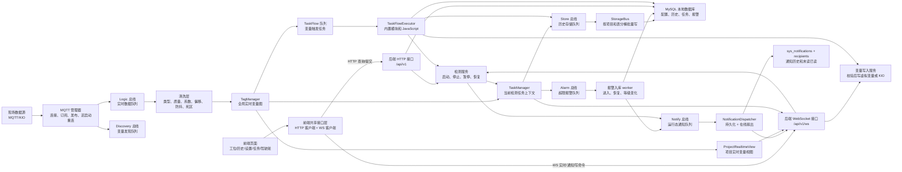
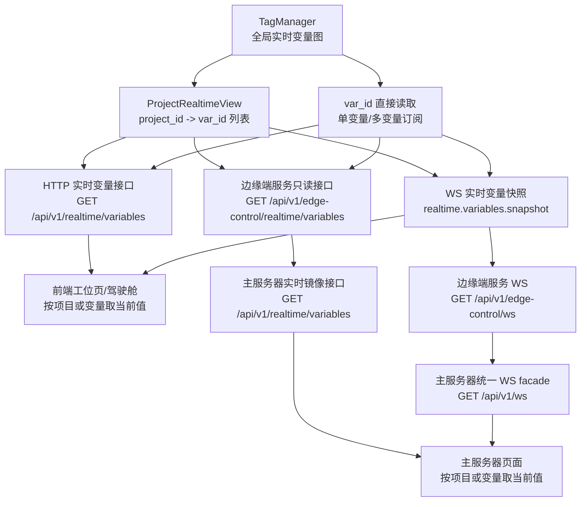
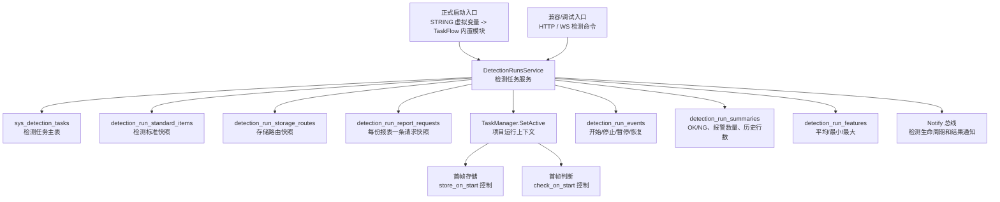
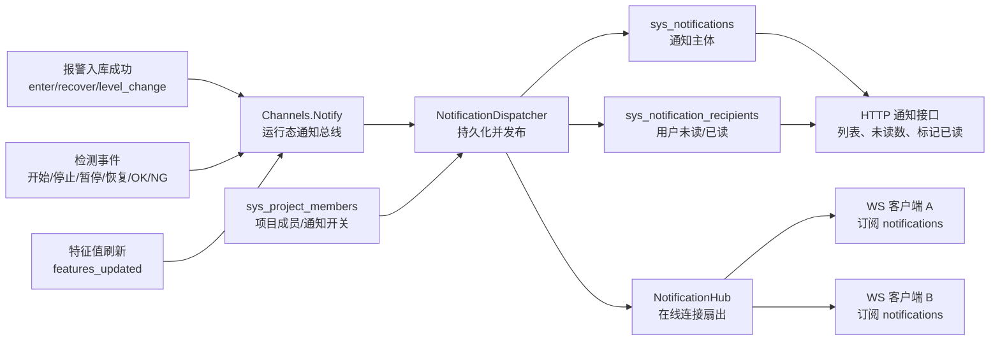
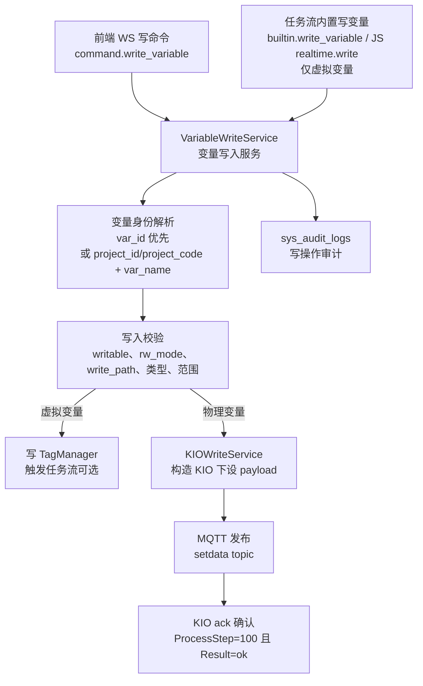
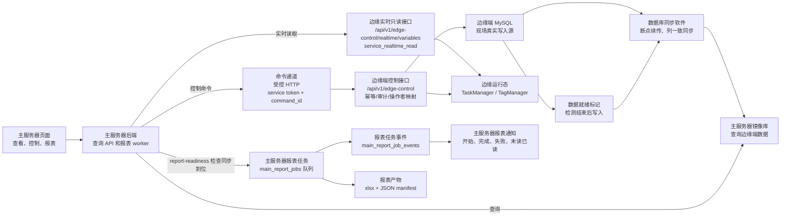

# 边缘端全链路数据流转与分发图

最后更新：2026-06-08

维护责任：`backend-ai`

本文件是边缘端后端的数据流总地图。后续只要修改采集、清洗、实时内存、项目视图、检测任务、存储、报警、任务流、通知、WebSocket 或 HTTP 接口分发，除了更新 `AI_BOARD.md`，还必须同步更新本文档。

## 0. 英文名词中文解释

| 英文名词 | 中文解释 |
| --- | --- |
| `MQTT` | 现场数据消息协议。当前 KIO/采集站点通过 MQTT 主题向后端推送实时数据。 |
| `KIO` / `KingIOT` | 当前现场使用的上位机/IO 数据源协议格式。后端通过 MQTT 收 KIO 数据，也通过 MQTT 下设 KIO 写入命令。 |
| `HTTP` | 普通请求/响应接口。前端用它查询配置、提交表单、启动/停止检测、查询历史和任务记录。 |
| `WebSocket` / `WS` | 双向长连接。前端用它接收实时快照和即时通知，也用它发送受控写命令。 |
| `MySQL` | 本地历史数据库。配置、检测任务、历史数据、报警记录、任务执行记录都写在这里。 |
| `Tag` | 一个变量的运行态对象，包含变量配置、当前值、质量、时间戳、清洗状态。 |
| `TagManager` | 后端内存里的全局变量大 map，核心键是 `var_id`。 |
| `Project` | 项目。当前已替代旧“设备”概念，是页面展示、检测任务和项目宽表的业务分组。 |
| `Gateway` | 数据源站点。它是 MQTT/KIO 连接来源，不是项目父级。 |
| `Storage Route` | 存储路由。描述某变量要存到哪个目标、哪个表、哪个列、什么频率或触发方式。 |
| `Task Flow` | 任务流。由变量变化、手动调试、项目生命周期等触发，执行内置业务模块或 JavaScript。 |
| `Notification` | 通知。当前边缘端已支持运行态即时推送、通知持久化和本地用户未读/已读；主服务器镜像通知读取同步库，已读状态用主服务器自有覆盖表记录。 |
| `Report Request` | 报表请求快照。某次检测需要主服务器为哪些变量生成报表的冻结清单。 |
| `ReportPackage` | 主服务器报表业务包。把任务身份、报表请求、变量指标、上下限、参数和客户模板单元格映射装配成可追溯产物。 |
| `Cell Mapping` | Excel 单元格映射。描述客户模板某个 sheet/cell 应填入任务编号、参数、变量平均值、上下限等来源。 |
| `Station View` | 工位显示配置。描述工位页卡片区和列表区显示哪些变量、按什么顺序显示。 |
| `Layout Area` | 布局区域。当前正式值为 `card_pool`（卡片区）和 `list_layout`（列表区）。 |
| `Snapshot` | 快照。某一时刻的当前状态集合，例如实时变量快照、当前检测任务快照。 |
| `Queue` / `Channel` | Go 内存队列。用于把采集热路径和数据库/业务慢操作解耦。 |
| `Main Server` | 主服务器。当前已有后端骨架、同步库只读接口、受控 edge-control HTTP client、登录/SSO、审计日志查询、通知镜像查询和已读覆盖、实时镜像转发、报表 worker、Excel 产物和主服务器自有报表通知。 |
| `Database Sync` | 数据库同步软件。独立于本应用，把边缘端数据库同步到主服务器镜像库，支持断点续传。 |
| `SSO` | 单点登录。当前边缘端创建一次性 ticket，主服务器通过边缘端 service-token 接口验证 ticket 后签发自己的页面 JWT。 |

## 1. 总览图



## 2. 当前所有总线和队列

| 名称 | 中文职责 | 来源 | 去向 | 是否持久化 | 当前风险/说明 |
| --- | --- | --- | --- | --- | --- |
| `Channels.Logic` | 实时数据逻辑总线 | MQTT/KIO 消息 | 清洗 worker | 否 | 热路径，不能阻塞数据库。 |
| `Channels.Discovery` | 变量发现总线 | 首次全量 KIO/MQTT 快照 | 发现 worker、`sys_tags` | 间接持久化 | 只生成候选变量，默认不进入运行态。 |
| `Channels.Store` | 历史存储总线 | 检测运行上下文、任务流存储模块 | `StorageBus` | 最终写 MySQL | 存储慢操作和采集热路径解耦。 |
| `Channels.Alarm` | 检测超限报警总线 | `TaskManager` 判断 | 报警入库 worker | 最终写 MySQL | 进入、恢复、等级变化都走这里。 |
| `Channels.Notify` | 运行态通知总线 | 报警入库、检测服务、任务流 | `NotificationDispatcher` | 最终写 MySQL + WS | 先持久化为通知历史，再在线扇出到 WS。 |
| `TaskFlowExecutor.input` | 任务流执行队列 | 变量变化倒排索引、手动调试 | 任务流 worker | 执行结果写 MySQL | 低优先级任务靠后，避免热路径直接跑脚本；`GET /api/v1/task-flows/runtime` 暴露 `submitted/enqueued/dropped` 用于判断是否发生队列满丢弃。 |
| `StorageBus` 分桶 | 存储批量写内部队列 | `Channels.Store` | 项目宽表、兼容历史表 | 是 | 按 `project_id + table_name` 合并批量写。 |
| `NotificationHub` 订阅表 | WS 在线通知分发 | `NotificationDispatcher` | 已连接 WS 客户端 | 否 | 断线后可通过 HTTP 通知列表补历史，在线连接仍只收即时推送；`GET /api/v1/runtime/notifications` 可查看在线订阅数、订阅缓冲使用率、通知扇出丢弃计数、是否过压、影响路径和下一步处置建议。 |

运行日志监控：后端每 5 秒检查 `Channels.Logic/Discovery/Store/Alarm/Notify` 的队列长度和容量，超过 80% 时写 `[runtime] channel pressure ...` 日志，用于现场判断实时延迟是否来自内部队列积压；该监控只读内存队列，不写数据库。`GET /api/v1/runtime/channels/detail` 返回每个队列的 `len/cap/usage/dropped/pressure/impact/next_action` 和已过压队列列表，给设置页或现场诊断使用；`dropped` 是该核心队列已知的累计满队列丢弃次数，覆盖 Logic、Discovery、Store、Alarm、Notify 的主要非阻塞发送点，用来区分“当前只是积压”和“已经发生过数据/事件拒收”；`impact` 说明受影响业务链路，`next_action` 给出第一步排查方向，旧 `GET /api/v1/runtime/channels` 仍只返回长度，保持兼容。`GET /api/v1/task-flows/runtime` 返回任务流执行队列的 `len/cap/usage/pressure/impact/next_action`、累计 `submitted/enqueued/dropped`、过压状态和当前检测结束守护数量；如果 `dropped` 增长，说明变量触发或手动调试任务已经因为任务流队列满被拒绝，需要检查任务优先级、脚本/SQL 耗时和递归触发。`GET /api/v1/runtime/notifications` 返回在线通知 hub 的订阅数、订阅缓冲 `buffered/capacity/usage`、`pressure/impact/next_action` 和 `published/delivered/dropped` 计数，用于判断 WS 通知是否因前端消费慢而被在线扇出丢弃；丢弃只影响即时 WS，历史仍以 HTTP 通知列表补齐。核心后台 goroutine 使用统一 recover 包装，panic 时写 `[worker] panic recovered name=... err=... stack=...`，覆盖实时处理、周期扫描、发现、存储、报警、通知分发、任务流执行、任务流定时扫描和检测结束守护 worker。`GET /api/v1/runtime/workers` 暴露这些 worker 的 `active/starts/exits/panics/health/impact/next_action/last_*`，用于判断 worker 是否已经因 panic 停止；该接口只报告状态，不自动重启 worker，现场处置通常是查看 panic 日志和重启后端。

并发延迟测试：现场 IO/KIO/MQTT 不在线时，不把真实采集和 PLC 下设作为通过条件。后端使用 `go run -tags smoke_tools ./tools/smokelatency -n <数量> -c <并发> -p95-max 2s -max-max 5s` 测量可控链路：WS 写 watched `STRING` 虚拟变量 -> `VariableWriteService` 更新内存 -> `var_id -> flow_ids` 倒排索引投递任务流队列 -> `builtin.context_set` 执行 -> `task_flow_runs` 落库。该工具输出 min/p50/p90/p95/max/avg，并在 p95 或最大耗时超过阈值时失败；常规后端总验收使用 `go run -tags smoke_tools ./tools/smokebackend -latency-n 30 -latency-c 10` 串联健康检查、多项目检测、EB-045 业务链和该延迟门禁。现场采集和下设恢复后再单独补 MQTT/KIO 全链路压测。

## 3. 上行实时数据链路

上行指现场数据进入边缘端。

```text
现场 MQTT/KIO 数据
  -> mqttx.Manager（MQTT 连接管理器）
  -> Channels.Logic（实时数据总线）
  -> logic_worker（实时处理 worker）
  -> GatewayTopicIndex（gateway_id + topic -> tags 索引）
  -> 清洗滤网
       - 类型转换：FLOAT / INT / BOOL / STRING
       - 质量码转换：例如 KIO 质量码 192 视为有效
       - 系数和偏移：scale_factor / offset_val
       - 可疑值过滤：suspicious_value
       - 防抖：debounce_threshold / debounce_ms
       - 死区：deadband
  -> TagManager（全局实时变量图）
```

清洗层只更新变量实时部分和质量戳，不直接查数据库，不直接写历史，不直接判断业务上下限。

MQTT broker 晚于边缘后端启动时，`mqttx.Manager` 会在初始连接失败后持续后台重试；恢复成功后重新执行配置订阅和 KIO 全量查询请求，并更新 `/health`、`/api/v1/gateways` 暴露的 `active`、`last_connected`、`last_error`、`reconnects` 和 `subscribed_topics`。现场不应再通过重启后端或无意义 PATCH 网关配置来恢复初始连接失败的 gateway。

回归证据：`backend/go test ./internal/pipeline -run TestProcessMessageKIOPayloadUpdatesOnlyIndexedKnownTags -count=1` 使用真实 KingIOT/KIO `Objs/PVs` payload 验证这一链路，包括业务名重映射后仍按原始 KIO `JSONPath` 取值、`PVs` fallback、质量码进入 runtime snapshot，以及 `gateway/topic` 索引不串台。

## 4. 变量发现链路

变量发现只负责把来源变量登记为候选。

```text
首次 KIO 全量快照
  -> mqttx.Manager
  -> Channels.Discovery（变量发现总线）
  -> discovery worker
  -> sys_tags（变量表）
       - discovered=true
       - enabled=false
       - project_id=null
```

关键约束：

- 自动发现变量默认不是运行态变量。
- 必须分配项目并启用后，才进入 `TagManager`。
- 未分配变量不参与清洗、实时 WS、存储、检测、报警、任务流。

## 5. 实时变量分发链路



分发规则：

- 全量订阅：不带 `project_id` 和 `var_id`，会拿全部运行态变量，前端应谨慎使用。
- 项目订阅：带 `project_id`，走项目索引。
- 单点/多点订阅：带一个或多个 `var_id`，走直接读取，不先组全量。
- 主服务器实时镜像：主服务器用户侧 `GET /api/v1/realtime/variables` 不读同步 MySQL 镜像库，而是按 `project_id` 或显式 `edge_instance_id` 解析目标边缘，用该边缘的 service token 调 `GET /api/v1/edge-control/realtime/variables` 读取对应 `TagManager` 内存快照；`project_id + edge_instance_id` 不匹配会返回明确错误，不会跨边缘兜底。缺 service token 返回 `503 edge_realtime_token_missing`，禁用返回 `503 edge_realtime_disabled`，边缘端不可达返回 `502 edge_realtime_unavailable`。
- 主服务器网关运行态镜像：主服务器用户侧 `GET /api/v1/gateways` 不读同步 MySQL 的 `sys_gateways` 来伪造在线状态，而是按 `edge_instance_id` 或项目/任务上下文解析目标边缘，用该边缘的 service token 调 `GET /api/v1/edge-control/gateways` 读取边缘端 `mqtt.Manager.Status()`。它用于显示 MQTT/KIO gateway 当前 active、last_error、订阅主题等内存运行态；配置列表仍走同步库只读 `GET /api/v1/gateway-configs`。
- 主服务器 WS facade：主服务器用户侧 `GET /api/v1/ws` 先校验主服务器 JWT 和 `view_realtime` 权限，浏览器可用 `access_token` 查询参数建连；主服务器通过 `edges[]` registry 按 `project_id`、`task_id` 或显式 `edge_instance_id` 选定边缘，再用该边缘 service token 连接 `GET /api/v1/edge-control/ws`，边缘端只接受 `service_realtime_read` scope。主服务器不会把主站 JWT 透传给边缘端，也不是裸代理浏览器到边缘端；桥接出的 realtime/detection/notification 消息会补顶层 `edge_instance_id`。`topic=notifications` 已用于 main_server 通知中心即时刷新，断线补偿仍靠 HTTP 通知列表。WS bridge read limit 当前为 4 MiB，用于修复首帧大 snapshot 被 256 KiB 限制截断的问题。
- 主服务器 WS 命令：`command.detection.start/stop/abnormal_stop/pause/resume` 和 `command.write_variable` 不直接转发到边缘 WS 执行。主服务器先校验主站用户权限，再按每条 command 的业务目标解析 edge：优先使用显式 `edge_instance_id`，否则读取 payload 中的 `project_id/task_id/var_id/project_code/var_name`，通过同步库 `sys_projects/sys_detection_tasks/sys_tags` 找到目标边缘；多边缘且无法解析目标时返回明确错误，不默认发给 `edge-1`。解析完成后主服务器包装 `operator_id/operator_name/operator_username/command_id/payload` 调用对应边缘的既有 `/api/v1/edge-control/*` HTTP 通道；边缘端继续负责 `edge_control_commands` 幂等、操作者映射、`sys_audit_logs` 和现场业务执行。这样断线重连不会自动重放危险命令，命令语义也不分裂成第二套模型。前端命令专用连接可能不带任何 `topic`，例如 `sendRealtimeWebSocketCommand` 只打开 `/api/v1/ws?access_token=...` 后发送一条 `command.*`；主服务器在这种情况下不能因为边缘实时 WS 读侧关闭就提前关闭客户端连接，必须保持客户端命令侧直到返回 `command.ack` 或 `error`。写变量失败时如果边缘端已经形成部分执行结果，边缘 WS error、edge-control HTTP 失败响应和主服务器 WS error 都会带 `payload.result` 或顶层 `result`，其中包含 `var_id_text`、`broker_accepted`、`project_confirmed` 和 `kio.status`；PID 页面应使用该结果显示 ack/error 状态，再用后续实时变量快照判断最终 readback。
- 命令生命周期诊断：边缘端 `GET /api/v1/edge-control/commands/:command_id` 要求 `service_runtime_read`，按当前 service `client_id + command_id` 读取 `edge_control_commands` 状态、结果、错误和时间，不返回原始 `request_json`。它用于主服务器和测试确认 WS/HTTP 控制命令确实进入边缘端命令生命周期。
- 当前联调证据：`VITE_APP_ROLE=main_server` 前端工位页实际 WS 连接只出现 Vite dev server `5174` 和主服务器 `ws://127.0.0.1:19080/api/v1/ws`，没有直连边缘端 `18080`；成功型命令 smoke 通过主服务器 WS 写临时 `STRING` 虚拟变量，边缘命令生命周期为 `status=success/action=variable.write`，审计为 `edge_control.variable.write/result=success`，实时快照读回写入值后删除临时变量。2026-06-04 EB-062 已通过真实一主二边缘 command smoke：HTTP edge-control envelope 可只在 `payload` 带 `project_id/var_id/project_code + var_name` 自动路由，WS command-only 连接可只在 command payload 带 `project_id` 或 `var_id` 自动路由；edge-2 停止时目标命令返回 `502 edge_backend_unavailable`，edge-1 和 main-server 仍保持健康。
- 前端涉及变量选择、WS 写入、任务流绑定、检测标准项、storage route 配置、历史查询跳转、报警/通知筛选或特征值展示时，应优先使用响应里的 `var_id_text` / `trigger_var_id_text`。`var_id` 仍保留为数字兼容字段，但大 64 位 ID 会超过浏览器安全整数范围，正式写入链路不能依赖 JavaScript `number` 保存精确值。

### 5.1 工位显示配置链路

```text
系统设置/工位显示配置
  -> PUT /api/v1/station-view/items
  -> sys_station_view_items.layout_area
       - card_pool：卡片区变量或变量组
       - list_layout：列表区变量、检测项或运行状态
  -> GET /api/v1/station-view/effective?project_id=...
  -> 前端按 layout_area 分组渲染
  -> 前端按 ws_subscription.var_ids 订阅实时变量
```

工位显示配置是低频配置链路，不进入 MQTT 清洗热路径，不直接修改 `TagManager`、检测运行快照、报警状态或存储路由。新 API/DTO 使用 `layout_area=card_pool|list_layout`，不再向前端暴露旧 `region_key` 或左右区域语义；数据库中的旧字段只作为迁移和历史同步兼容。前端的个人拖拽顺序、置顶或本机偏好属于用户覆盖层，不能回写系统默认 `sort_order`。

## 6. 存储链路

```text
TagManager 当前稳定值
  -> TaskManager 当前检测上下文
  -> 判断当前项目是否有 running 检测任务
  -> 判断该变量是否允许存储
       - detection_run_standard_items.store_enabled
       - detection_run_storage_routes.enabled
       - storage route 的 trigger_mode / cycle_ms / deadband / store_on_start
  -> Channels.Store（历史存储总线）
  -> StorageBus（按 project_id + table_name 分桶）
  -> MySQL
       - rt_history_data：兼容窄表
       - rt_project_{project_id}_data：项目动态宽表
```

存储配置不属于变量属性，属于 `sys_storage_routes`，检测启动时冻结到 `detection_run_storage_routes`。启动时后端会保证每个合格变量有一条默认 disabled route 建议，但真正进入本次运行快照的是该变量所有 enabled route；用户自定义 route 只要 enabled，也会被冻结并进入存储热路径。

项目宽表说明：

- 默认表名是 `rt_project_{project_id}_data`。
- 列来自 storage route 的 `column_name`。
- 启动检测或 schema prepare 阶段自动建表/扩列。
- schema prepare 会修复旧项目宽表缺失的 `project_id/project_code` 固定列；默认 `rt_project_{project_id}_data` 会按表归属回填 `project_id`。
- 历史查询从旧宽表重建 DTO 时，如果旧表没有 `project_id/project_code`，会回退使用 `detection_run_storage_routes` 冻结的项目元数据，避免 `history/data?project_id=...` 因旧表结构返回 500。
- 移除变量不会删除历史列，避免破坏历史查询和已有数据。
- 前端查看某次检测实际使用的存储去向时，读取 `GET /api/v1/detection-runs/{id}/storage-routes`，不要拿最新 `sys_storage_routes` 反推历史任务；响应里的 `var_id_text` 是前端再次筛选或跳转变量详情时的优先 ID。

## 7. 检测任务链路



检测状态：

- `running`：运行中，参与存储和报警判断。
- `paused`：暂停中，不参与存储和报警判断，暂停时长不计入累计检测时长。
- `stopped`：已结束。

结束类型：

- `manual_stop`：手动结束。
- `abnormal_stop`：异常结束。
- `fixed_duration`：固定时长结束。
- `qualified_hold`：合格持续时长结束。
- `task_flow_stop`：任务流模块结束。

检测启动参数边界：

- 前端可以通过 HTTP 查询和维护检测标准、收藏、最近使用和当前运行快照。
- 会改变现场业务状态的动作必须写入 watched `STRING` 虚拟变量，由 `TaskFlow` 的 `data_change` 触发执行。
- `STRING` 指令 JSON 支持 `project_id`、`test_no`、`standard_id`、`custom_items`、`limit_check_enabled`、`end_policy`、`duration_sec`、`qualified_hold_ms`、`operator_note`、`process_params`、`plc_writes` 等字段。这里的“配置参数”是一次任务请求的业务参数包，不只是检测标准项。
- `process_params` 是本次检测的低频工艺/报表参数，例如进风口面积、工装编号、环境修正参数；它会随检测冻结进 `custom_config_json`，供报表、计算和审计追溯使用。
- `report_request` 是本次检测要交给主服务器生成报表的请求清单；后端会在检测启动时冻结到 `detection_run_report_requests`，一行表示一份报表请求。推荐格式是 `report_request.reports[]`，每项可指定 `template_id` 或 `template_code`、一个或多个变量、以及 `params` 参数对象。旧格式 `variables`、`var_ids`、`variable_names` 和 `ext_1/ext_2/ext_3` 仍兼容，但新需求不要继续把参数写进 `ext_*`。
- `plc_writes` 是受控下设计划，例如把 `process_params.inlet_area_m2` 写入某个可写 PLC/KIO 变量；它必须由 `builtin.write_control_variables` 显式执行，继续走后端变量写入约束、KIO/PLC service、审计日志和可选 ack 等待。
- 同一个业务值只应有一个来源。进风口面积这类参数放在 `process_params`，PLC 下设步骤用 `value_from` 引用它，避免前端在“检测配置”和“PLC 参数”里重复填两份；它不应混入 `custom_items`，因为 `custom_items` 只表示变量级检测标准快照。
- 预置变量请求启动检测、固定时长检测和合格持续检测模板都会先执行 `builtin.write_control_variables`，再执行 `builtin.start_detection_run`。这样 `plc_writes` 中的进风口面积等现场控制参数先下设，随后检测任务再冻结 `process_params/plc_writes/operator_note/report_template_id` 追溯信息。
- `end_policy=manual` 表示手动结束；`fixed_duration` 表示固定时长结束；`qualified_hold` 表示合格持续时长结束。
- `custom_items` 会冻结到 `detection_run_standard_items`，不写回检测标准模板。
- `report_request` 只冻结报表请求和模板身份，不在边缘端执行 Excel 填充。模板公式参数由 `sys_report_templates.params_schema_json` 描述，本次取值冻结到 `detection_run_report_requests.params_json`；主服务器通过数据库同步看到 `detection_run_report_requests` 后，按 `test_no/project_id/template_code/variables_json/params_json` 和同步到位的历史数据生成报表。
- 任务参数 payload 当前上限为 256 KiB，目的是支持低频自定义检测配置，同时防止 WS/任务通道被大包拖垮。
- 520 个完整 `custom_items` 的实测 STRING payload 约 166 KiB，解析约 3.25ms，转换为运行快照约 0.56ms；在当前规模下不需要改成实时流式配置。`sys_detection_tasks.custom_config_json` 只保存紧凑追踪信息，运行判断仍以 `detection_run_standard_items` 为准。
- 任务流 `vars[].var_id`、WS `command.write_variable.payload.var_id`、WS `subscribe.var_ids[]`、`plc_writes[].var_id`、检测标准项 `var_id` 和 storage route `var_id` 都支持字符串形式的 64 位变量 ID，避免前端解析大数字后精度丢失。
- WS 订阅回执会在 numeric `var_ids` 之外返回 `var_id_texts`；WS 写变量成功回执会返回 `result.var_id_text`，写变量错误帧在存在部分执行结果时也会返回 `payload.result.var_id_text`。前端在重订阅、跳转、筛选和再次下设时应优先使用这些字符串字段。
- 任务流 JavaScript 运行态的 `trigger.var_id_text`、`context.trigger_var_id_text`、`realtime.get/getMany` 快照结果和 `realtime.write` 写入结果也会提供精确字符串 ID。`steps_json` 参数绑定使用 `source=event,key=trigger_var_id_text` 时也会通过后端保存校验。开发者脚本不要把大变量 ID 先转成 JavaScript `number` 再传回后端。

## 8. 报警链路

报警分为两个 scope：

- `detection`：检测业务报警，读取运行快照，支持检测静音，参与检测摘要。
- `default`：变量默认报警，读取 `sys_tags.default_*`，不依赖检测任务，不带静音，不参与检测摘要。

```text
TagManager 当前值变化
  -> TaskManager.EvaluateLimitAlarm（scope=detection，检测上下文里的超限状态机）
       - 读取 detection_run_standard_items 的运行快照
       - 判断 limit_ll / limit_l / limit_h / limit_hh
       - 判断 limit_deadband（回差）
       - 判断 violation_hold_ms（超限保持时间）
       - 判断 recover_hold_ms（恢复保持时间）
       - 判断 quality_policy（质量策略）
       - 处理静音：只屏蔽静音瞬间已经存在的报警
  -> TaskManager.EvaluateDefaultLimitAlarm（scope=default，变量资产默认报警）
       - 读取 sys_tags.default_alarm_enabled
       - 判断 default_limit_ll / default_limit_l / default_limit_h / default_limit_hh
       - 判断 default_limit_deadband
       - 判断 default_violation_hold_ms / default_recover_hold_ms
       - 不带静音
  -> Channels.Alarm（报警总线）
  -> alarm_worker（报警入库 worker）
  -> detection_limit_alarms（用 scope 区分 detection/default）
       - enter：进入报警
       - recover：恢复报警
       - level_change：报警等级变化
  -> Channels.Notify（通知总线）
  -> WS notification.event（即时通知）
```

报警表 `detection_limit_alarms` 是追溯数据源；通知只是在线提醒。检测摘要只按 `task_id` 聚合检测报警，默认报警使用 `task_id=0`，不会污染检测 OK/NG 结果。

前端查询报警明细统一使用 `GET /api/v1/limit-alarms`。`scope=default` 查询变量默认报警，`scope=detection` 查询检测业务报警，不传 `scope` 时返回两类报警；接口支持按项目、任务、测试号、变量、状态、报警类型、报警等级和首次报警时间筛选。报警响应带 `var_id_text`，前端筛选或跳转变量详情时优先使用它。

## 9. 通知链路

当前边缘端已经实现“即时通知 + 本地通知中心”。即时提醒走 WS，断线补历史、未读数和标记已读走 HTTP。报警通知类型 `alarm.*` 在通知中心保留 90 天，后端写入 `expires_at=occurred_at+90d`，HTTP 列表和未读数默认排除已过期报警通知；`detection_limit_alarms` 报警记录本身不删除，仍用于历史追溯。



当前支持的通知类型：

| 通知类型 | 中文含义 |
| --- | --- |
| `alarm.limit.enter` | 超限报警进入，包含检测业务报警和变量默认报警。 |
| `alarm.limit.recover` | 超限报警恢复，包含检测业务报警和变量默认报警。 |
| `alarm.limit.level_change` | 超限报警等级变化，包含检测业务报警和变量默认报警。 |
| `detection.run_started` | 检测开始。 |
| `detection.run_stopped` | 检测正常或任务流停止。 |
| `detection.run_abnormal_stop` | 检测异常停止。 |
| `detection.run_paused` | 检测暂停。 |
| `detection.run_resumed` | 检测恢复。 |
| `detection.result_ok` | 检测结果合格。 |
| `detection.result_ng` | 检测结果不合格。 |
| `detection.features_updated` | 检测特征值刷新。 |

当前通知中心接口：

| 接口 | 中文含义 |
| --- | --- |
| `GET /api/v1/notifications` | 查询当前用户通知列表，支持 `unread/type/level/project_id/from/to/keyword/limit/offset`。 |
| `GET /api/v1/notifications/unread-count` | 查询当前用户未读数，支持 `type/level/project_id/from/to/keyword` 分类筛选，已过期报警通知不计入。 |
| `POST /api/v1/notifications/{id}/read` | 标记单条通知为已读。 |
| `POST /api/v1/notifications/read-all` | 标记当前用户通知为已读；不带筛选时处理全部可见未读通知，带 `type/level/project_id/from/to/keyword` 时只处理匹配项。 |
| `GET /api/v1/projects/{id}/members` | 查询项目成员和通知接收开关。 |
| `PUT /api/v1/projects/{id}/members` | 替换项目成员列表，用于项目级通知精确分发。 |

当前实现边界：

- `target_type=all` 写给全部启用的本地边缘端用户。
- `target_type=user` 写给指定本地用户 ID。
- `target_type=role` 写给指定角色下的启用本地用户。
- `target_type=project` 优先写给 `sys_project_members` 中该项目启用通知的本地用户；如果该项目还没有任何成员配置，暂时仍兜底写给全部启用用户，避免升级后检测通知突然没人收到。
- WS 仍只做在线即时推送；断线期间的补偿由 HTTP 通知列表完成。
- 报警通知的过期只影响通知中心列表、未读数和标记已读范围，不影响报警中心通过 `GET /api/v1/limit-alarms` 查询原始报警记录。
- 边缘端通知中心只负责本地边缘端用户。主服务器页面读取同步来的边缘通知时，不直接修改同步表 `sys_notification_recipients.read_at`，而是把主服务器用户的已读覆盖状态写入 `main_notification_reads`，查询和未读数使用 `COALESCE(main_notification_reads.read_at, sys_notification_recipients.read_at)`。这样分类已读和单条已读能在主服务器页面生效，同时不会破坏数据库同步软件管理的边缘源表。
- 主服务器报表通知属于主服务器自己的通知中心，当前由 `main_report_notifications/main_report_notification_recipients` 承载，不写同步来的边缘通知表。

当前通知中心链路：

```text
Channels.Notify
  -> NotificationDispatcher（通知分发器）
  -> sys_notifications（通知主体）
  -> sys_notification_recipients（本地用户未读/已读）
  -> 在线 WS 推送
  -> HTTP 通知列表 / 未读数 / 标记已读
```

主服务器镜像通知链路：

```text
数据库同步软件
  -> sys_notifications / sys_notification_recipients（边缘通知镜像，只读源）
  -> 主服务器通知 API（按主站登录用户和 edge context 过滤）
  -> main_notification_reads（主服务器自有已读覆盖，不回写边缘镜像表）
  -> HTTP 通知列表 / 未读数 / 单条已读 / 分类已读

边缘 NotificationHub
  -> edge-control WS
  -> 主服务器 /api/v1/ws facade
  -> 主服务器前端通知中心即时刷新
```

建议接收对象类型：

- `user`：指定用户。
- `role`：指定角色。
- `project`：指定项目相关人员或页面。
- `all`：全部在线用户。
- 后续可扩展 `site` / `station`。

## 10. 任务流链路

任务流正式业务入口以变量变化为根基。

```text
前端填写业务参数
  -> WS command.write_variable
  -> 写入 watched STRING 虚拟变量
  -> TagManager 更新变量值
  -> TaskFlowIndex（var_id -> flow_ids 倒排索引）
  -> TaskFlowExecutor.input（任务流执行队列）
  -> TaskFlow worker
       - 条件脚本 condition_script
       - 内置模块 steps_json
       - JavaScript 高级脚本
          * realtime.get / getMany / getByName / project 读取实时变量
          * realtime.get / getMany / write 支持字符串形式 var_id
          * realtime.write 只允许写虚拟变量，受审计保护，默认不继续触发任务
  -> task_flow_runs（执行记录）
  -> task_flow_sql_logs（脚本 SQL 日志）
```

内置模块可以调用：

- 启动检测。
- 停止检测。
- 暂停/恢复检测。
- 固定时长结束守护。
- 合格持续时长结束守护。
- 报警静音。
- 运行中限值调整。
- 特征值刷新。
- 存储快照。
- 存储表准备。
- 受控变量写入。
- 报表结果登记。
- 受控 HTTP 请求。

任务执行器不能在采集热路径里同步执行脚本；数据变化只投递队列。

当前检测业务的任务约束：

- 前端通过 HTTP 获取检测配置、收藏配置、最近使用配置和当前运行快照。
- 检测配置页的数据源是 `detection-standards/projects/variables/report-templates` 这些 HTTP API，不直接查数据库；变量关联以 `var_id` 为准，`var_name` 只做业务编码和维护定位，显示名按 `display_name/display_name_en/display_name_ja` 做三语 fallback。
- `sys_detection_standard_items` 保存/替换时会补齐缺失的变量三语显示快照，检测启动后再冻结到 `detection_run_standard_items`；后续变量改名不会回写历史标准项或运行快照。
- 固定下拉枚举使用后端稳定值、前端三语翻译：`check_method=numeric_range|bool_equals|string_equals|regex`，`quality_policy=ignore_bad|record_invalid|fail_on_bad`，检测标准 `mode` 当前使用 `standard|task_flow`。
- 正式开始检测、停止、暂停、恢复、静音、运行中改上下限或启停检测变量，都必须写入 STRING 虚拟变量后由任务系统执行。
- `builtin.start_detection_run` 支持自定义检测项、是否启用上下限、固定时长结束和合格持续时长结束。
- `builtin.update_detection_limits` 支持单项或 `items` 批量调整运行中快照，调整后刷新项目运行上下文。
- `builtin.refresh_features` 会刷新 `detection_run_features`，同时写入 `detection_run_events(features_updated)` 并推送 `detection.features_updated` 通知。
- 后端启动时会从 running 检测任务恢复固定时长和合格持续守护。

检测启动和结束也会派发项目生命周期任务流事件：

```text
检测启动成功
  -> TaskFlowEvent(project_start)
  -> trigger_type=project_start 的任务流

检测正常结束 / 任务流结束 / 异常结束
  -> TaskFlowEvent(project_end)
  -> trigger_type=project_end 的任务流
```

生命周期事件的 `task_params` 会携带 `task_id`、`project_id`、`project_code`、`test_no`、`status`、`end_type` 和 `trigger_type`。

定时任务也已经进入同一套任务流队列：

```text
TaskFlow schedule scanner（定时扫描器）
  -> 每秒扫描一次 trigger_type=schedule 的启用任务
  -> 按 schedule_interval_ms 判断是否到期
  -> TaskFlowExecutor.input（任务流执行队列）
```

如果 `schedule_interval_ms` 为空但 `cooldown_ms` 有值，后端临时把 `cooldown_ms` 当作定时间隔，便于前端适配期间不阻断测试。正式 UI 应使用 `schedule_interval_ms`。

任务流配置管理链路：

```text
前端任务页
  -> HTTP GET/POST/PATCH/DELETE /api/v1/task-flows
  -> sys_task_flows / sys_task_flow_vars
  -> TaskFlowExecutor.Load（重载内存倒排索引和触发索引）
```

删除任务流只删除配置和变量绑定，不删除 `task_flow_runs` 与 `task_flow_sql_logs`，避免丢失执行审计。
`GET /api/v1/task-flows/:id` 用于编辑器按 ID 刷新单条任务配置。

## 11. 下行写入链路

下行指前端或任务系统写变量到边缘端或现场。



关键约束：

- 前端不能绕过后端直接写 MQTT。
- `command.write_variable` 支持两种变量身份：优先使用 `payload.var_id`；没有 `var_id` 时，可以用 `payload.project_id + payload.var_name` 或 `payload.project_code + payload.var_name`。这里的 `var_name` 是后端业务映射名，不是 KIO 原始名 `raw_name`，也不是 `source_path`。
- 如果项目内运行态变量没有这个 `var_name`，返回结构化错误 `variable_not_found`；如果同一项目内有多个运行态变量使用同一个 `var_name`，返回 `ambiguous_variable`，前端必须改用精确 `var_id` 或先修正变量映射。
- 物理变量必须满足写入约束后才能下设。
- 虚拟变量写入可以触发任务流，但需要防递归。
- 写命令需要审计。
- KIO/物理变量写入的错误结果必须结构化传递到 WS/HTTP 调用方：`broker_accepted=false,status=gateway_offline` 表示 gateway 离线、命令未发布；`broker_accepted=true,status=ack_timeout_or_unmatched` 表示 MQTT broker 已接收但 KIO ack 超时或未匹配；`status=confirmed` 表示 KIO ack 确认完成。前端 PID/控制页必须用这些字段区分“未发出”“已发出等待回读”和“已确认”，不能只解析错误字符串。

## 12. HTTP 配置和查询链路

HTTP 主要负责低频配置和查询。

```text
前端页面
  -> shared API 客户端
  -> /api/v1/*
  -> runtime handlers（参数解析、权限、状态码）
  -> services（业务规则和运行态协调）
  -> database.Repository（MySQL 持久化）
  -> JSON 响应
```

典型用途：

- 登录、用户、SSO。
- 项目管理。
- 变量属性管理。
- 存储路由管理。
- 工位画面 effective view 查询：`GET /api/v1/station-view/effective?project_id=...` 读取 `sys_station_view_templates/regions/items/assignments`，先检查 `sys_projects.edge_instance_id` 是否匹配本机边缘实例，再按当前项目解析模板绑定，并返回允许订阅的 WS `var_ids`；无绑定时返回空 bindings 和 warnings，不让前端用全量变量列表做生产兜底。若多条模板 assignment 命中后同分且同版本，返回 `409 station_view_template_conflict`，不按 ID 或创建时间静默兜底。`GET /api/v1/station-view/templates` 提供模板版本和 assignment 可见性；`PATCH /station-view/templates/:id` 和 `/station-view/assignments/:id` 只改低频配置元数据；`POST /station-view/reload` 只做默认模板补齐、配置诊断和可选 effective 校验，不写变量、不操作检测任务、不改变 running/paused 快照。
- 检测标准管理。
- 检测任务兼容/调试启动停止接口；正式现场动作应走 STRING 虚拟变量触发任务系统。
- 检测任务详情、运行快照、摘要、事件、特征值。
- 历史数据查询。
- 任务流配置、执行记录、SQL 日志。
- 审计日志查询。
- 数据库配置。

## 13. 前端消费数据的方式

| 前端区域 | 主要数据来源 | 中文说明 |
| --- | --- | --- |
| 工位页 | HTTP + WS | HTTP 先查 `station-view/effective` 决定左/右区域、显示项、顺序和当前项目过滤后的绑定；WS 按 effective view 返回的 `project_id/var_ids` 接实时变量；检测限值和当前运行快照走 HTTP `detection-runs/current`。如果 effective view 没有 bindings，页面显示空态和后端 warnings，不再拉全量变量自行跨项目过滤。 |
| 驾驶舱 | HTTP + WS | 按项目或变量订阅实时值，展示模型点位和指标。 |
| 历史页 | HTTP | 查询 `history/data`，后端可能从项目宽表重建兼容 DTO。 |
| 检测配置页 | HTTP | 管理检测标准和标准项、收藏和最近使用，不直接查数据库；不直接执行现场检测动作。 |
| 变量管理页 | HTTP | 管理变量资产属性、写入约束、默认限值和项目分配。 |
| 存储路由页 | HTTP | 管理变量如何存入项目宽表或其他目标。 |
| 任务页 | HTTP + WS 写命令 | HTTP 管理任务流、模板、执行记录；正式业务参数通过写 STRING 虚拟变量触发。未来拖拽式前端只消费后端模块 schema，本阶段不实现拖拽 UI。 |
| 全局通知区 | WS + HTTP | WS 接 `notification.event` 即时提醒；HTTP 查通知列表、未读数和标记已读。 |

精确变量 ID 约束：

- `history/data`、`limit-alarms`、`detection-runs/{id}/features`、`notifications` 和 WS `notification.event` 都返回 `var_id_text`。
- 前端展示仍可显示 `var_id`，但再次请求、筛选、跳转、任务流脚本参数或下设时应使用 `var_id_text`，避免大 64 位 ID 被浏览器 number 截断。

## 14. 当前未完成或待扩展节点

1. 默认报警前端展示：默认报警 enter/recover/level_change 已经通过 `scope=default` 写入统一超限表，后端 `GET /api/v1/limit-alarms` 已提供筛选查询入口，`smokeeb045` 已现场验证默认报警 WS/HTTP 通知闭环和落库读回；后续还需要前端列表页/详情入口继续打磨。
2. 主站控制通道：受控 HTTP 首版已在边缘端和主服务器最小调用链实现，具体鉴权、scope、幂等和审计模型见 `边缘端HTTP主服务器控制通道设计.md`。当前边缘端已支持 `/api/v1/edge-control/detection/start`、`/detection/stop`、`/detection/abnormal-stop`、`/detection/pause`、`/detection/resume`、`/detection/mute-alarms`、`/detection/update-limits`、`/detection/refresh-features`、`/detection/report-requests` 和 `/variables/write`，均要求 service token、细粒度 `edge.*` scope、`command_id`、操作者 envelope 和本地用户映射，并写入 `edge_control_commands` 与 `sys_audit_logs`；边缘端同时支持只读 `GET /api/v1/edge-control/realtime/variables`，要求 `service_realtime_read` scope，直接读取 `TagManager` 快照且不写命令生命周期。主服务器端已实现同名白名单 `POST /api/v1/edge-control/*` 转发和用户侧 `GET /api/v1/realtime/variables` 实时镜像转发，通过 `edges[]` registry 按 `edge_instance_id`、`project_id` 或 `task_id` 选目标边缘并读取该边缘 `service_token_ref` 指向的环境变量作为 Bearer service token；为共用前端，主服务器也把 `POST /api/v1/detection-runs`、`POST /api/v1/detection-runs/:id/stop`、`POST /api/v1/detection-runs/:id/abnormal-stop`、`POST /api/v1/detection-runs/:id/pause`、`POST /api/v1/detection-runs/:id/resume` 包装成 edge-control envelope 后转发，仍由边缘端执行、审计和幂等去重。主服务器 raw query/write proxy 已禁用，未显式实现的 `/api/v1/**` 写方法和 `/api/v1/edge-proxy/**` 写方法返回 `501 edge_control_required`，未显式实现的读方法和 `/api/v1/edge-proxy/**` 读方法返回 `501 main_server_query_route_not_implemented`。主服务器最小登录/SSO 已实现，读取同步 `sys_users` 签发主服务器 JWT，并通过边缘端 service-token 接口验证一次性 SSO ticket；主服务器也已提供同步 `sys_audit_logs` 和 `sys_notifications/sys_notification_recipients` 的只读查询。后续重点转为完整现场组合 smoke，以及是否给 `detection_limit_alarms` 增加持久化静音字段。
3. 前端旧 `device` 命名清理：页面层仍需继续统一为 `project`。
4. 任务系统更多模板和端到端业务 smoke：后端已新增 `go run -tags smoke_tools ./tools/smokeeb045` 验证正式 STRING 请求变量触发启动、冻结 `custom_items/process_params/plc_writes`、`storage_prepare`、运行中限值调整、检测静音 `muted=1`、报表登记、受控 HTTP 请求、暂停、恢复、任务流停止、WS 异常停止、特征值刷新事件、`detection.features_updated` 通知 WS/HTTP 未读已读联动、固定时长自动结束、合格持续自动结束、检测生命周期 `detection.run_started/run_paused/run_resumed/run_stopped/run_abnormal_stop` 通知、`detection.result_ok` 通知、检测业务报警 `alarm.limit.enter/level_change/recover`、变量默认报警 `alarm.limit.enter/level_change/recover`、默认报警 `scope=default` 落库查询、WS 写请求审计、WS 异常停止命令审计、任务流控制变量写入审计和停止后的 `detection.result_ng` 通知；这些通知都已验证 WS 即时推送和 HTTP 未读/已读联动。后续继续补更多现场数据组合 smoke。
5. 通知项目成员 UI 收敛：后端已补 `sys_project_members` 和 `GET/PUT /api/v1/projects/{id}/members`，`target_type=project` 在配置成员后会按 `notify_enabled` 精确分发；前端设置页用户管理模块已提供项目成员/通知接收配置入口，空成员列表固定返回 `items:[]`。未配置成员的项目仍临时全员兜底，避免升级后检测通知无人接收。

## 15. 未来边缘端与主服务器协同链路

详细计划见 [边缘端与主服务器协同计划](./边缘端与主服务器协同计划.md)。

核心原则：

- 边缘端数据库是现场真实写入源。
- 主服务器通过专用数据库同步软件查询镜像库。
- 主服务器不能直接修改镜像库里的边缘端业务表来控制现场。
- 开始检测、停止检测、修改检测配置、写变量等控制动作，必须通过命令通道回到边缘端执行。
- 主服务器报表任务基于同步到位的数据生成报表产物。当前已实现 `main_report_jobs` 队列、`main_report_job_events` 生命周期事件、JSON manifest 追溯文件、可下载 `.xlsx` 产物和主服务器自有报表通知；模板 workbook 可访问时会追加数据页。主服务器 report worker 会在启动 schema 检查时确保系统默认模板 `SPINDLE_DEFAULT_REPORT v1`，文件引用为 `templates/default-report-template.xlsx`，缺少请求模板或模板不可达时先使用该默认模板；`generated_default_missing_template` 只作为默认模板本身无法创建/打开时的防御兜底。EB-069 首段已支持 `ReportPackage` 留痕和 `params_json.cell_mapping` 指定 Excel sheet/cell 填入任务编号、参数、变量指标和上下限；连续合格两小时窗口已基于同步历史扫描实现。真实客户模板验收和默认模板 cell mapping smoke 仍待补。

当前主服务器后端已落地的最小查询节点：

- 主服务器同名业务读接口必须登录主服务器 JWT，并按权限访问；只读同步库不是公开查询。项目、变量、检测任务、报警和工位视图走 `view_realtime`，历史数据走 `view_history`，任务流执行记录走 `system_settings`。
- `GET /api/v1/main-server/status` 返回 `edge_nodes[]`，中文含义是“主服务器已知边缘节点列表”，包含 `edge_instance_id`、边缘地址、同步库名、service token 引用和 enabled 状态。
- `GET /api/v1/main-server/sync-diagnostics` 是主服务器侧受保护同步库诊断接口，读取关键同步表并返回表级 `ok/missing/error`、行数、最新时间列、缺失表列表和 `overall_status`；当前已包含网关配置、检测标准、检测标准项、收藏、最近使用、当前存储路由、任务流配置和报表模板等低频配置同步表。缺表时返回 `200 degraded`，用于暴露同步缺口，不造空样例。
- `GET /api/v1/main-server/report-readiness?task_id=...` 是主服务器侧受保护报表数据就绪诊断接口，读取同步库真实检测任务、报表请求、摘要、特征值、历史数据、存储路由和检测报警，返回 `overall_status=ready|waiting|not_requested`、检查项和每份报表请求缺失的变量数据。它只判断镜像库当前数据是否足够生成报表，不创建主服务器报表任务，不生成 Excel，不写同步库。
- `POST /api/v1/main-server/report-jobs/enqueue`、`GET /api/v1/main-server/report-jobs`、`GET /api/v1/main-server/report-jobs/:id`、`GET /api/v1/main-server/report-jobs/:id/events`、`GET /api/v1/main-server/report-jobs/:id/artifact` 和 `POST /api/v1/main-server/report-jobs/:id/retry` 是主服务器自有报表 worker 首段接口。它们只写 `main_report_jobs/main_report_job_events/main_report_notifications/main_report_notification_recipients`，不写 `detection_run_report_requests`、`sys_detection_tasks` 或其他边缘同步业务表；worker 每次处理都会重查 readiness，数据未到位保持 `waiting`，并记录 `enqueued/started/waiting/succeeded/failed/retried` 生命周期事件；`started/succeeded/failed` 事件会生成主服务器报表通知；到位后写 JSON manifest 和 `.xlsx` 到 `reports.artifact_dir`，其中 `artifact_ref` 指向 `.xlsx`，`succeeded` 事件 payload 带 `manifest_ref`。EB-069 后 manifest 额外包含 `report_package`，Excel 额外包含 `Report_Package` 追溯页，并在 `params_json.cell_mapping` 存在时按指定单元格填值。artifact 下载只允许读取成功 job 且路径仍在 `reports.artifact_dir` 下的主服务器自有 `.xlsx` 产物；未成功返回 `409 report_artifact_not_ready`，文件缺失或越界返回 `404 report_artifact_unavailable`。
- `GET /api/v1/system/database-config` 在主服务器侧是本地只读配置视图，返回主服务器自身镜像库连接配置、`password_set`、`read_only=true` 和 `source=main_server_config`，不代理边缘端数据库配置、不返回明文密码；`PATCH /api/v1/system/database-config` 和 `POST /api/v1/system/database-config/test` 返回 `501 main_server_database_config_read_only`。
- `GET /api/v1/gateway-configs` 和 `GET /api/v1/gateway-configs/:gateway_id` 是主服务器侧受保护同名网关配置只读接口，读取同步库真实 `sys_gateways`，返回边缘端兼容 DTO、`edge_instance_id` 且隐藏密码字段。它只表示“同步库里登记了哪些 MQTT/KIO 网关配置”，不表示这些网关此刻在线。
- `GET /api/v1/projects/:id/members` 是主服务器侧受保护同名项目成员只读接口，读取同步库真实 `sys_project_members` 并 JOIN 同步 `sys_users`，返回成员用户名、用户角色、启用状态、成员角色和通知开关；按 edge context 排除显式归属其他边缘项目。主服务器不直接写同步项目成员表。
- `GET /api/v1/gateways` 在主服务器侧按 `edge_instance_id` 或可解析的项目/任务上下文选择目标边缘，通过 service token 转发到边缘端 `/api/v1/edge-control/gateways`，读取边缘端 MQTT/KIO 网关内存运行态。它不读同步库、不 mock 在线状态；缺 token 返回 `503 edge_runtime_token_missing`，禁用返回 `503 edge_runtime_disabled`，边缘不可达返回 `502 edge_runtime_unavailable`。
- `GET /api/v1/runtime/channels`、`GET /api/v1/runtime/channels/detail`、`GET /api/v1/runtime/notifications`、`GET /api/v1/runtime/workers` 和 `GET /api/v1/task-flows/runtime` 在主服务器侧按 `edge_instance_id` 或可解析的项目/任务上下文选择目标边缘，通过 service token 转发到边缘端 `/api/v1/edge-control/runtime/*` 与 `/api/v1/edge-control/task-flows/runtime`，读取边缘端核心队列、通知 hub、worker 生命周期和任务流执行队列诊断。缺 token 返回 `503 edge_runtime_token_missing`，禁用返回 `503 edge_runtime_disabled`，边缘不可达返回 `502 edge_runtime_unavailable`；这些接口不读同步库、不造 mock 队列状态。
- `GET /api/v1/task-modules` 和 `GET /api/v1/task-flow-templates` 在主服务器侧按 `edge_instance_id` 选择目标边缘，通过 service token 转发到边缘端 `/api/v1/edge-control/task-modules` 与 `/api/v1/edge-control/task-flow-templates`，读取边缘端任务执行元数据。缺 token 返回 `503 edge_metadata_token_missing`，禁用返回 `503 edge_metadata_disabled`，边缘不可达返回 `502 edge_metadata_unavailable`；这些接口不从同步库推断任务模块。
- `GET /api/v1/ws` 是主服务器统一 WebSocket facade。它要求主服务器用户 JWT 和 `view_realtime`，支持浏览器 `access_token` 查询参数，按 `project_id/task_id/edge_instance_id` 通过 `edges[]` registry 选择目标边缘，拒绝跨边缘 mismatch，然后用 service token 连接边缘端 `/api/v1/edge-control/ws`。边缘端 WS 会推实时变量、检测任务和通知，也接受写变量/检测控制命令；主服务器 WS 命令仍转换为受控 edge-control HTTP 命令，不在主服务器直接执行现场逻辑。
- `GET /api/v1/report-templates` 是主服务器侧同名只读报表模板接口，读取同步库真实 `sys_report_templates`，支持 `enabled/keyword` 查询，返回模板编码、版本、文件引用和 `params_schema_json`，供主服务器页面和未来报表 worker 理解模板参数。主服务器当前不直接写同步模板表。
- `GET /api/v1/storage-routes` 是主服务器侧同名只读当前存储路由接口，读取同步库真实 `sys_storage_routes`，支持 `project_id/var_id/enabled` 查询，返回 `var_id_text`；它表示“现在配置里这个变量应该如何入库”，不是某次检测已经冻结的历史入库快照。历史任务详情和追溯仍使用 `GET /api/v1/detection-runs/:id/storage-routes`。
- `GET /api/v1/task-flows` 和 `GET /api/v1/task-flows/:id` 是主服务器侧受保护同名只读任务流配置接口，读取同步库真实 `sys_task_flows/sys_task_flow_vars`，支持 `project_id/trigger_type/enabled`，详情和列表都返回变量绑定 `vars[].var_id_text`。主服务器不直接创建、编辑、删除或运行同步来的任务流；`GET /api/v1/task-flows/runtime` 只读边缘端内存任务流队列诊断。
- `GET /api/v1/detection-standards`、`GET /api/v1/detection-standards/:id`、`GET /api/v1/detection-standards/favorites` 和 `GET /api/v1/detection-standards/recent` 是主服务器侧同名只读检测标准接口，读取同步库真实 `sys_detection_standards/sys_detection_standard_items/sys_detection_standard_favorites/sys_detection_standard_recents`；列表支持 `project_id/project_code/mode/enabled/keyword`，详情返回标准项和 `var_id_text`，收藏/最近使用按当前主服务器登录用户的同步 `user_id` 读取。主服务器当前不直接写同步标准表或用户偏好表。
- `GET /api/v1/projects` 是主服务器侧同名只读项目列表，读取同步库真实 `sys_projects`，按 `edge_instance_id` 上下文排除显式归属其他边缘的项目；未填写 edge 归属的旧项目仍作为当前边缘同步数据展示。
- `GET /api/v1/variables` 是主服务器侧同名只读变量列表，读取同步库真实 `sys_tags`，支持 `gateway_id/project_id/project_code/var_group/writable/enabled/discovered/source_type/keyword`，`device_id` 查询参数会明确返回 `400 unsupported_query_param`；调用方必须使用 `project_id`。接口返回包含 `var_id_text` 的边缘端兼容变量 DTO，并按 edge context 过滤显式归属其他边缘项目的变量。PID 等现场操作页应先用该低频配置列表解析可写变量，再用 `/api/v1/ws` 或 `/api/v1/realtime/variables` 读取实时值。
- `GET /api/v1/history/data` 是主服务器侧同名只读历史接口，读取同步库真实历史；策略与边缘端一致：先根据 `detection_run_storage_routes` 读项目动态宽表并还原为 `HistoryData`，宽表无数据时回退 `rt_history_data`。响应包含 `items/count/limit` 和 `var_id_text`。
- `GET /api/v1/limit-alarms` 是主服务器侧同名只读超限报警接口，读取同步库真实 `detection_limit_alarms`；支持 `scope/project_id/task_id/test_no/var_id/status/alarm_type/alarm_level/from/to/limit/offset`，响应包含 `items/total/limit/offset` 和 `var_id_text`。
- `GET /api/v1/task-flow-runs`、`GET /api/v1/task-flow-runs/:id`、`GET /api/v1/task-flow-runs/:id/sql-logs` 是主服务器侧同名只读任务流执行记录和 SQL 日志接口，读取同步库真实 `task_flow_runs/task_flow_sql_logs`；响应包含 `trigger_var_id_text`，详情和 SQL 日志会按 run 所属项目校验 edge context。
- `GET /api/v1/detection-runs/active` 是主服务器侧同名只读活动检测任务列表，读取同步库中 `running/paused` 的 `sys_detection_tasks`，并按 `edge_instance_id` 上下文排除显式归属其他边缘项目的任务。
- `GET /api/v1/detection-runs/current?project_id=...&edge_instance_id=...` 是主服务器侧同名只读当前检测快照，先校验项目 edge 上下文，再读取 running/paused `sys_detection_tasks`，并附带 `detection_run_standard_items`、`detection_run_storage_routes`、备忘录摘要、报表结果和报表请求快照。没有当前任务时返回 `404 not_found`，不返回硬编码空任务。
- `GET /api/v1/detection-runs`、`GET /api/v1/detection-runs/:id`、`/summary`、`/features`、`/events`、`/storage-routes`、`/report-requests`、`/notes` 是主服务器侧同名只读检测任务接口族，读取同步库真实 `sys_detection_tasks/detection_run_*` 表；列表按 edge context 过滤显式归属其他边缘的项目，详情附带标准项、存储路由、备忘录摘要、报表结果和报表请求快照；notes 只读同步 `detection_run_notes`，`POST /api/v1/detection-runs/:id/notes` 返回 `501 main_server_detection_note_write_unsupported`。
- `GET /api/v1/station-view/effective?project_id=...&edge_instance_id=...` 是主服务器侧同名只读工位接口，输入/输出 DTO 与边缘端一致；它只读同步库真实 `sys_projects/sys_tags/sys_station_view_* / sys_detection_tasks/detection_run_standard_items` 表，不 seed、不写库、不使用 mock。传入 `edge_instance_id` 时校验 `project_id + edge_instance_id`，只传 `project_id` 时从 `sys_projects.edge_instance_id` 自动解析目标边缘；项目不存在返回 `404 station_view_project_not_found`，项目与显式 edge 不匹配返回 `404 station_view_edge_instance_mismatch`，项目未配置 edge 且多边缘下无法唯一解析返回 `409 station_view_edge_instance_ambiguous`，单边缘但项目未配置 edge 返回 `409 station_view_edge_instance_unresolved`。同步配置还没到位时返回 `503 sync_not_ready`；多条模板 assignment 同分同版本时返回 `409 station_view_template_conflict`，保证主服务器镜像接口和边缘端不会选择不同模板。
- `GET /api/v1/station-view/templates` 是主服务器侧同名只读模板列表，读取同步库真实 `sys_station_view_templates/sys_station_view_assignments`，返回模板版本、状态和 assignment；`POST /api/v1/station-view/reload` 在主服务器侧只返回 `sync_diagnostics_only` 同步诊断，不写同步库、不 seed、不调用 `/edge-control/*`。
- `GET /api/v1/audit-logs` 是主服务器侧受保护审计日志只读接口，读取同步 `sys_audit_logs`，支持 actor/action/target/result/time 分页筛选。
- `GET /api/v1/notifications` 和 `GET /api/v1/notifications/unread-count` 是主服务器侧受保护通知镜像接口，按登录用户同步 `user_id` 读取 `sys_notifications/sys_notification_recipients`，支持未读、类型、级别、项目、时间和关键词筛选，响应包含 `var_id_text` 和 JSON `payload`。主服务器不写同步来的 `read_at`；`POST /api/v1/notifications/:id/read` 与 `/read-all` 写入主服务器自有 `main_notification_reads` 已读覆盖表，并在查询时覆盖同步接收人读状态。主服务器报表通知另走 `GET /api/v1/main-server/report-notifications`、`GET /api/v1/main-server/report-notifications/unread-count`、`POST /api/v1/main-server/report-notifications/:id/read` 和 `/read-all`，只读写主服务器自有报表通知表。
- `GET /api/v1/realtime/variables` 是主服务器侧受保护实时镜像接口，不读同步库，而是用 service token 调边缘端 `GET /api/v1/edge-control/realtime/variables`，读取边缘端 `TagManager` 当前内存快照并保留查询过滤。缺 service token 返回 `503 edge_realtime_token_missing`，禁用返回 `503 edge_realtime_disabled`，边缘端不可达返回 `502 edge_realtime_unavailable`。
- 报表 worker 已完成首段；station view 已完成最小模板列表、边缘端 assignment/template 元数据发布启停、reload 诊断和冲突策略。拖拽式模板设计器、多主冲突合并、跨边缘聚合模板发布仍未完成。
- `POST /api/v1/auth/login`、`GET /api/v1/auth/me`、`GET /api/v1/users` 和 `POST /api/v1/auth/sso-ticket/verify` 是主服务器最小用户会话链路。主服务器读取同步 `sys_users`，但 JWT 与边缘端分离；边缘端一次性 SSO ticket 的消费仍回到边缘端验证接口完成。
- `POST /api/v1/edge-control/detection/start|stop|abnormal-stop|pause|resume|mute-alarms|update-limits|refresh-features|report-requests` 和 `POST /api/v1/edge-control/variables/write` 是主服务器侧受控现场命令入口。它们不写主服务器镜像库，只调用边缘端同名 `/api/v1/edge-control/*`；缺 service token 返回 `503 edge_control_token_missing`，边缘端不可达返回 `502 edge_backend_unavailable`。
- `POST /api/v1/detection-runs`、`POST /api/v1/detection-runs/:id/stop`、`POST /api/v1/detection-runs/:id/abnormal-stop`、`POST /api/v1/detection-runs/:id/pause`、`POST /api/v1/detection-runs/:id/resume` 是主服务器为共用前端提供的同名检测控制入口。主服务器只校验用户 JWT 和权限、补操作者字段和 `command_id`、把 URL `:id` 转成 `payload.task_id`，实际检测启动/停止/暂停/恢复仍进入边缘端 `/api/v1/edge-control/detection/*`。



当前边缘端已新增 `detection_run_report_requests`，中文含义是“检测运行报表请求快照”。它可在检测启动时生成，也可由主服务器后续通过 `/api/v1/edge-control/detection/report-requests` 为已有检测任务追加，一行表示某次检测需要主服务器生成一份报表；这份报表可以绑定一个变量，也可以绑定多个变量。记录会冻结模板身份、`variables_json` 变量组和 `params_json` 公式参数，`ext_1/ext_2/ext_3` 仅作为旧兼容预留字段。主服务器看到它同步到镜像库后，可调用 `POST /api/v1/main-server/report-jobs/enqueue` 创建或复用 `main_report_jobs`，worker 再用 `GET /api/v1/main-server/report-readiness?task_id=...` 等价检查历史数据、报警、摘要、特征值是否到位；处理过程写入 `main_report_job_events`，页面可通过 `GET /api/v1/main-server/report-jobs/:id/events` 查询事件轨迹；确认后生成 JSON manifest 和可下载 `.xlsx`。报表开始、成功、失败会写入 `main_report_notifications/main_report_notification_recipients`，页面可通过 `main-server/report-notifications` 查询和标记已读。EB-069 首段后 `.xlsx` 会写入运行数据页、`Report_Package` 完整追溯页，并可按 `params_json.cell_mapping` 填客户模板指定单元格；映射 schema 见 [报表业务口径与客户模板单元格映射设计](./报表业务口径与客户模板单元格映射设计.md)。

当前边缘端已新增 `edge_control_commands`，中文含义是“边缘端主服务器控制命令生命周期表”。主服务器调用 `/api/v1/edge-control/*` 时必须携带稳定 `command_id`，边缘端按 `client_id + command_id` 去重，重复成功或失败命令返回原结果，正在执行的命令返回 `command_running`，避免 HTTP 重试导致重复启动检测、重复停止、重复变量下设、重复限值调整或重复报表请求。控制 handler 只做 service-token 鉴权、scope 校验、操作者映射、幂等、审计和错误响应映射，实际检测、运行快照、报表请求和变量写入仍复用 `DetectionRunsService`、`VariableWriteService` 和 `KIOWriteService`。
